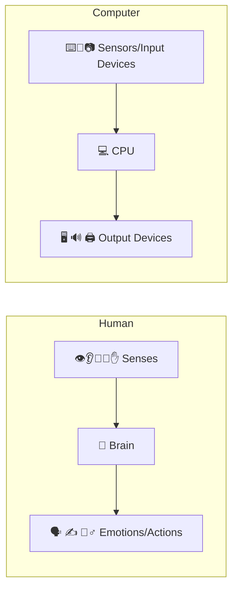
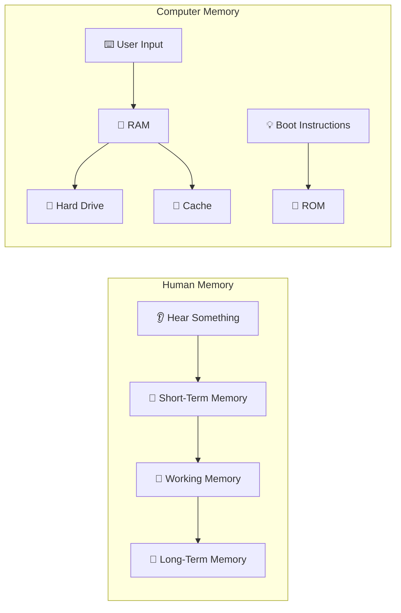
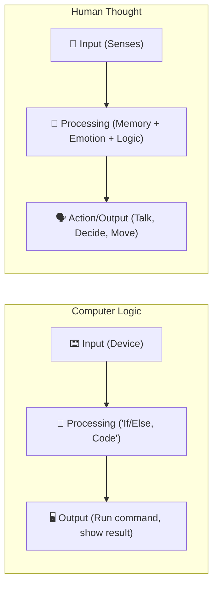
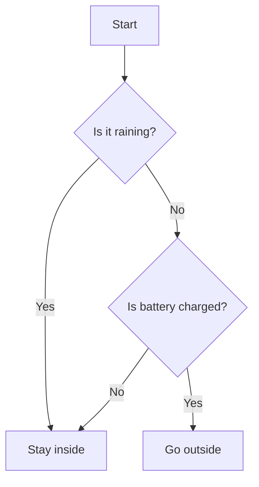
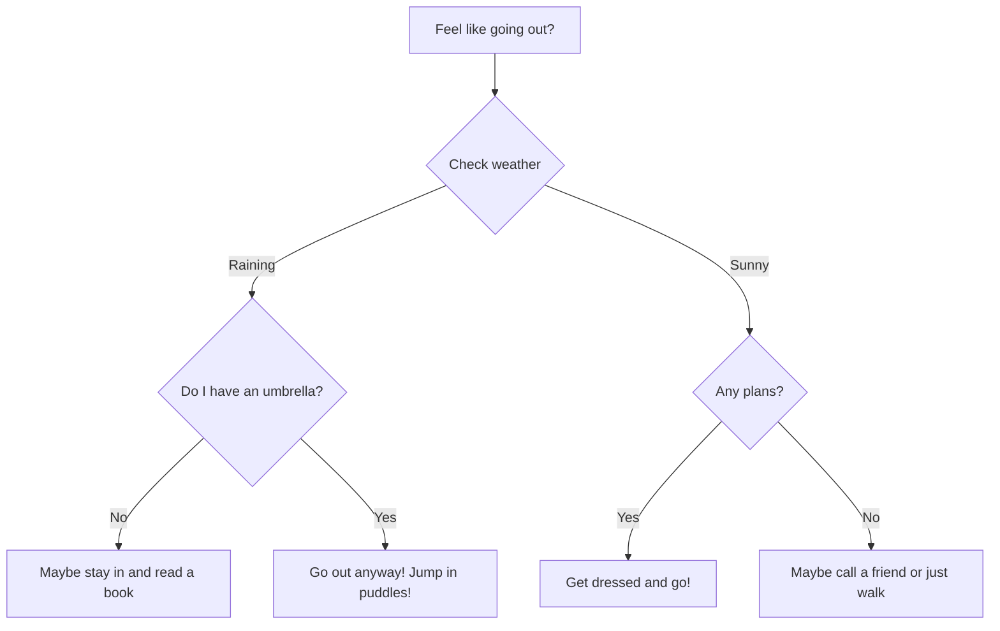
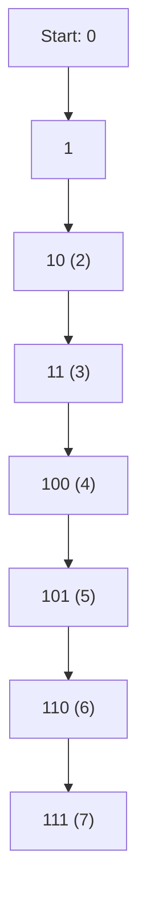

# 🌍👨‍💻 Humans and Computers 101 (HAC101)

> *A friendly intro to understanding how humans and computers are more alike than you think!*

---
## 🚀 MODULE 1 - “Welcome to Thinking Systems”

### Lesson 1 - “Input ➡️ Processing ➡️ Output”

Welcome to **HAC101**, where we explore the surprising ways humans and computers are **similar** — yes, really! Both of us follow the **same pattern** when it comes to how we deal with the world:

> **Input ➡️ Processing ➡️ Output** – *The Circle of System Life*

Let’s break this down for both species… uh, systems 😄

---

#### 🧠 Learning Goal

Understand the core cycle that powers both humans and computers —  
**Input ➡️ Processing ➡️ Output** — and recognize how this simple but powerful pattern shapes how we interact with the world, solve problems, and express ourselves.  
This lesson sets the foundation for everything that follows!

---

#### 🔍 What Are Inputs?

> 👁️‍🗨️ INPUTS: How We Receive the World 🌍

**Inputs** are how a system receives information from the outside world.

- For **humans**, these inputs come from our five magical senses. ✨  
- For **computers**, inputs come from sensors or devices like keyboards and microphones.

---

#### 👨‍ The Five Human Senses

We humans receive information through our **5 magical senses**:

> 🧠 Humans: Sensing the World

| Sense   | What it Does                             | Example                       |
|---------|-------------------------------------------|-------------------------------|
| 👁️  Vision   | Sees color, light, shapes, motion        | Watching a cartoon on TV      |
| 👂 Hearing  | Detects sounds, music, voices            | Hearing your name called      |
| 👃 Smell    | Identifies scents and odors              | Smelling fresh baked cookies  |
| 👅 Taste    | Detects flavors like sweet and sour      | Eating a sour candy 🍬        |
| ✋ Touch    | Senses pressure, temperature, and pain   | Feeling a breeze or a hug 🤗  |

> These senses are our **natural sensors** — they help us understand and survive in the world around us 🌎

> Together, they help us build a mental model of the world! 🌍

---

#### 🖥️  Computer Input Devices

> Computers: Devices Doing the Sensing

Just like us, computers need input to understand their environment. But instead of senses, they use hardware!

| Device         | What it Detects                      | Human Equivalent       |
|----------------|--------------------------------------|------------------------|
| ⌨️  Keyboard       | Keys pressed by the user              | ✋ Touch                |
| 🎤 Microphone     | Sounds and voices                     | 👂 Hearing              |
| 📷 Camera         | Images and motion                     | 👁️  Vision               |
| 🖱️  Mouse/Trackpad | Movement and clicks                   | ✋ Touch                |
| 👃 (Future tech!) | Some computers now detect smells 😮   | 👃 Smell                |

> Computers might not taste your lunch (yet), but they’re definitely getting better at sensing the world!


Old-school computers (like calculators 🧮) were simple:

| Device | Input Method |
|--------|--------------|
| 🧮 Calculator | Keypad input    |
| 🖥️  Early PCs  | Keyboard, Mouse |

> Computers use **hardware sensors** to gather data, just like our senses!

---

#### 🎨 Visualization: "Input Squad: How Humans and Robots Sense the World"

{: width="972" height="589" }
_A side-by-side look at how a child uses their five senses — sight, hearing, smell, taste, and touch — while a robot gathers input through devices like a camera, microphone, and keyboard. Both are systems designed to understand their environment, just in different ways!_

---

#### 🔄 PROCESSING: The Brain of the System

##### 🧠 Human Mind

We process information using our **brain** 🧠, which:
- Thinks
- Feels
- Remembers
- Makes decisions

> It's like a biological supercomputer… but way more creative.

---

##### 💾 Computer Processors

Computers use a **CPU (Central Processing Unit)** 💻 to:
- Run calculations
- Make logical decisions
- Process data lightning-fast ⚡

> A CPU is the "brain" of a computer, but it doesn’t dream or daydream...

---

#### 📤 OUTPUTS: What We Give Back

##### 🧍‍♂️ Humans Output

Humans express the result of their thinking in several ways:

| Action | Output |
|--------|--------|
| 🗣️  Speech | Talking, singing, communicating |
| ✍️  Writing | Notes, books, art |
| 🤸‍ Movement | Physical actions, gestures |
| 🎭 Emotions | Smiles, frowns, tears, laughter |

> Our output is **emotional**, **creative**, and often **unpredictable**!

---

##### 🖥️ Computer Output

Computers respond through:

| Device | Output |
|--------|--------|
| 🖥️  Monitor | Visuals, text, graphics |
| 🔊 Speakers | Sound, alerts, music |
| 🖨️  Printer | Physical documents |
| 💡 LEDs | Light signals, indicators |

> Computer outputs are **precise**, **predictable**, and **based on code** 💡

---

#### 🔁 Diagram: Human vs. Computer System



---

#### 🧠 Final Thoughts

At their core, **humans and computers are systems** designed to **receive, process, and respond to information**.

| Feature | Humans | Computers |
|--------|--------|-----------|
| Input | 5 senses | Input devices |
| Process | Brain | CPU |
| Output | Emotions, speech, action | Screen, sound, print |

**Why does this matter?**  
Understanding how these systems work helps us:
- Design better technology 🤖
- Understand ourselves better ❤️
- Create meaningful connections between mind and machine 🌐

---

#### ✅ Summary

- Humans receive information through **5 senses** 🧍‍♂️  
- Computers use **input devices** like keyboards, cameras, and microphones 🖥️  
- Both are systems that rely on gathering data to do anything meaningful!

---

#### ⏭️  Coming Up Next

In the next lesson, we’ll explore how **human memory** compares to **computer memory** — from forgetfulness to RAM overload 😅.

---

## 🧠 MODULE 2: PROCESSING – Thinking It Through

### Lesson 2: *"RAM, ROM & Remembering Grandma’s Cookies"*

---

#### 🧠 Learning Goal

Understand how memory works in both humans and computers — the types of memory each system uses, how they store information, and what makes them forget... or crash! 💥

---

#### 🧍 Human Memory: Forget Me Not!

Humans have different types of memory — and some are faster or more reliable than others:

| Type               | Description                                | Example                            |
|--------------------|--------------------------------------------|------------------------------------|
| 🧠 Short-Term Memory | Holds things for a few seconds/minutes      | Remembering a phone number briefly |
| 🧠 Long-Term Memory  | Stores information for years or forever     | Remembering your first pet 🐶       |
| 🧠 Working Memory    | Helps us think and problem-solve in the moment | Doing math in your head            |

> Sometimes we forget things (oops 😅), but sometimes they stick forever — especially the embarrassing ones!

---

#### 💻 Computer Memory: RAM-tastic and ROM-ready!

Computers also have types of memory, but they're a little more... structured:

| Memory Type | Description                                 | Human Equivalent        |
|-------------|---------------------------------------------|--------------------------|
| 💾 RAM       | Temporary memory, fast but erased on shutdown | 🧠 Working/short-term     |
| 💽 ROM       | Permanent memory that stores startup instructions | 🧠 Instincts/reflexes     |
| 🧱 Hard Drive | Long-term storage for files & data           | 🧠 Long-term memory        |
| 🔐 Cache     | Super quick, very small memory for frequently used stuff | 🧠 Habits/reflex shortcuts |

> RAM = “I remember this while I’m awake”  
> ROM = “I was born knowing this”  
> HDD = “Let me look it up in my archive!”

---

#### 💥 Forgetfulness vs. Crashes

- **Humans** forget things or mix them up.
- **Computers** don’t forget — but they **crash** if memory runs out or gets corrupted!

> That’s why saving your work is important. And maybe writing grocery lists too. 📝

---

#### 🔁 Diagram: Human vs. Computer Memory


#### 🧠 Final Thoughts

Memory is at the heart of what makes us — and our machines — so powerful.

- For **humans**, memory is a dance between forgetting and remembering. It's shaped by emotions, experience, and even the smell of Grandma’s cookies 🍪.
- For **computers**, memory is clean and consistent, but it lacks the messiness that makes human memories so… human.

While a computer might recall a file exactly as it was, we remember stories, feelings, smells, and moments. Our memories may not be perfect, but they help define who we are. 💖

And even though a computer can store **terabytes** of data, it still can’t remember the way a hug feels, or what it's like to laugh so hard your stomach hurts. 🤗💾

So, as we build smarter machines, let’s not forget what makes our own kind of memory special.  
We might forget where we left our keys, but we never forget the people we love. ❤️🔑

---

#### ✅ Summary

- Humans use **short-term**, **long-term**, and **working memory**.

- Computers use **RAM**, **ROM**, **cache**, and **hard drives**.

- Both systems are smart — but they handle memory very differently.

---

#### ⏭️  Coming Up Next
Next time, we’ll explore how both humans and computers make decisions using logic. Get ready for:

> Lesson 3 – *“The Brain That Codes & The Code That Thinks”* 🧠💻

---

### Lesson 3: *"The Brain That Codes & The Code That Thinks"*

---

#### 🧠 Learning Goal

Explore how humans use logic, emotions, and experience to make decisions — and how computers follow strict rules and code to do the same.  
We’ll learn what it means to “think logically” and how that differs between brains and machines.

---

#### 🔍 Decision Making: Human Style

Humans make decisions using more than just facts. We rely on:

- 🧠 Logic & reasoning
- ❤️ Emotions
- 📚 Past experiences
- ⚠️ Gut feelings (a.k.a. intuition)

For example:
> Should I eat the cake?  
> 🍰 → It’s delicious! (emotion)  
> 🍰 → I’m on a diet. (logic)  
> 🍰 → Last time I ate it, I felt sick. (memory)  
> = Hmm... maybe just one bite. 😅

---

#### 💻 Decision Making: Computer Style

Computers don’t have cravings or emotions.

They follow a strict chain of **logical instructions** called **code**.

Here’s how a computer might handle a similar problem:

```text
Algorithm: Should I Eat the Cake?

1. Check your hunger level.
2. If hunger level is greater than 7:
    a. Check if cake is available.
    b. If cake is available:
        - Eat the cake.
    c. Otherwise:
        - Wait.
3. Otherwise:
    - Wait.
```

And here’s a slightly more compact version:

```text
Algorithm: Should I Eat the Cake?

1. IF hunger level > 7 AND cake is available THEN
    → Eat the cake.
2. ELSE
    → Wait.

```

> No feelings. No regrets. Just clean, logical decision trees. 🧠💻🌲

---

#### 🧠 vs 💻 – A Side-by-Side

| Decision Maker | How It Works | Example |
|----------------|--------------|---------|
| 🧠 Human       | Combines logic, memory, emotions, and instinct | Choosing a gift for a friend 🎁 |
| 💻 Computer    | Uses code, conditions, and logic gates        | Sorting numbers, recommending movies 🎬 |

---

#### 🤔 Fun Fact

Some AI systems today can *simulate* decision-making by learning from large amounts of data —  
but they still don’t *understand* the meaning behind the decisions like we do.

> A machine can tell you what to watch…  
> but it doesn’t know you cry every time at the ending of your favorite movie. 🎥😭

---

#### 🔁 Diagram: Human vs. Computer Thinking Flow



---

#### 🧠💻 Flowchart Comparison Example

Let’s say the decision is: **“Should I go outside?”**

##### 💻 Computer Thinking (Flowchart)



> Logic-based. If A, then B. Simple and structured. ✅

##### 🧠 Human Thinking (Flowchart)



> Humans add emotion, spontaneity, and personal style to every choice 🌦️📖💃

---

#### 🧪 Try It Yourself

**Activity: Code Your Brain!**

Write down how you make a decision — like “what to wear” or “what to eat.”  
Then turn it into a simple logic tree or flowchart like a computer would.  
Compare your emotional reasoning to a code-only version!

---

#### 🧠 Final Thoughts

Humans are wonderfully messy decision-makers.  
We follow logic, sure — but also dreams, doubts, feelings, and stories.

Computers are clear and fast, but they only do what they’re told (for now!).

Both are powerful. But only one of them might cry at the end of a Pixar movie. 😢❤️💻

---

## 🧬 MODULE 0: The Genesis of Computers – *“From Sparks to Systems”* ⚡🧠💾

### Lesson 1: *“Once Upon a Binary: The Tale of 0 and 1”*

---

#### 🧠 Learning Goal

Discover how the digital world began from the simplest building blocks — **electricity** being ON or OFF — and how this evolved into **binary numbers** made of 0s and 1s.  
We’ll also explore the difference between **binary (base 2)** and the **decimal (base 10)** system we humans use every day.

This is the foundation of how computers think, store, and communicate — and it all starts with two tiny digits: **0** and **1**.

---

#### ⚡ A Spark of Intelligence

At the very core, a computer is just a machine that reacts to **electric signals**:

- 💡 **1** = Electricity is **ON**
- 🔌 **0** = Electricity is **OFF**

Computers don’t think in words or pictures — they sense electricity.  
They see the world as a **stream of tiny electric decisions**: ON, OFF, ON, ON, OFF...

---

#### 🧮 Binary: The Language of Machines

Binary is a number system just like decimal, but it only has **two digits**:  
**0** and **1** (hence the name “bi-nary”).

| Base | Digits Used | Example Count |
|------|-------------|---------------|
| Binary (Base 2) | 0, 1 | 0, 1, 10, 11, 100 |
| Decimal (Base 10) | 0–9 | 0, 1, 2, ..., 9, 10, 11, ... |

So in binary:
- `0` = 0  
- `1` = 1  
- `10` = 2  
- `11` = 3  
- `100` = 4  
- `101` = 5  
- `110` = 6  
- `111` = 7  
- `1000` = 8

Binary works just like decimal — every digit’s position matters — but instead of powers of 10, it’s powers of 2.

---

#### 🔢 Binary vs. Decimal (Side by Side)

| Decimal | Binary |
|---------|--------|
| 0       | 0      |
| 1       | 1      |
| 2       | 10     |
| 3       | 11     |
| 4       | 100    |
| 5       | 101    |
| 6       | 110    |
| 7       | 111    |
| 8       | 1000   |
| 9       | 1001   |
| 10      | 1010   |

> Computers love binary because it’s simple, reliable, and easy to build using **electric circuits**.

---

#### 🧠 Why Not Use Decimal in Computers?

Decimal would need 10 different voltage levels. That’s:
- Hard to build ⚙️
- Easy to mess up ❌
- More expensive 💸

Binary is:
- Just **on** and **off**
- Cheap ✅
- Fast ⚡
- Reliable 🛠️

That's why every photo, email, video, or game is, at its heart, just a bunch of 0s and 1s dancing inside your computer!

---

#### 🎨 Visualization: “Binary Begins - From Switches to Screens”

A visual tale of how 0s and 1s power the digital world

{: width="972" height="589" }
_A cartoon-style educational illustration showing a light switch labeled “0 = OFF” and “1 = ON” on the left, connected to a glowing row of binary digits (0s and 1s) that flow toward a happy computer screen, symbolizing how simple electrical signals become digital information._

---

#### 🔁 Diagram: Counting in Binary



---

#### 🧪 Try It Yourself

**Activity: Binary Counting Game**

1. Hold up fingers. Each finger is either UP (1) or DOWN (0).
2. Try to count in binary using your fingers:
    - 👇👇👇👇 = 0 (0000)
    - 👇👇👇☝️ = 1 (0001)
    - 👇👇☝️👇 = 2 (0010)
    - 👇👇☝️☝️ = 3 (0011)
    - 👇☝️👇👇 = 4 (0100)
    - 👇☝️👇☝️ = 5 (0101)
    - 👇☝️☝️👇 = 6 (0110)
    - 👇☝️☝️☝️ = 7 (0111)
    - ☝️👇👇👇 = 8 (1000)
3. See how far you can go!

> With just **5 fingers**, you can count up to 31 in binary. That's computer magic with human hands! 🧙‍♂️🤖

---

#### 🔍 Bonus Concept: Bit by Bit

Each 0 or 1 in binary is called a **bit** (short for “binary digit”).

- 1 bit → can hold two values (0 or 1)
- 4 bits → can count from 0 to 15
- 8 bits = 1 byte → can count from 0 to 255

> Everything you see on a screen — even this text — is built from **billions of bits** working together!

---

#### 🧠 Final Thoughts

It might seem unbelievable, but the **entire digital world** is built from this simple idea:  
**Electricity is either on or off. 1 or 0.**

With that, we built computers that can:
- Paint masterpieces 🖼️
- Play music 🎵
- Explore the stars 🚀
- And even power the apps and tools that help us learn every day. 🤖📱

So next time you see a 1 or a 0, remember — that’s not just a number.  
That’s the beginning of *everything* in the world of computing.

---

#### ⏭️  Coming Up Next

Now that you’ve learned the foundation of computer thinking, we’ll explore how both **humans and computers** process information differently.

Get ready for:  
**MODULE 1 – *“Welcome to Thinking Systems”***  
and **Lesson 1 – *“Input ➡️ Processing ➡️ Output”***
