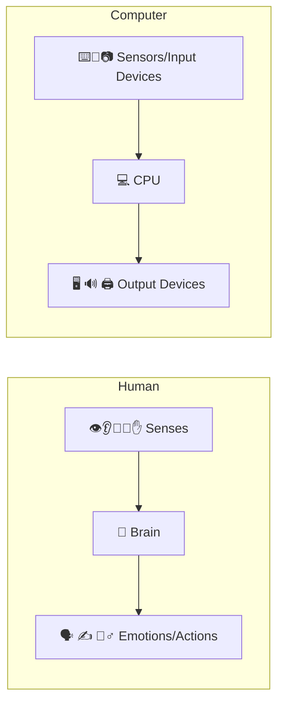

# 🌍👨‍💻 Humans and Computers 101 (HAC101)

> *A friendly intro to understanding how humans and computers are more alike than you think!*

---

## 🚀 Getting Started: The Human–Computer Pattern

Welcome to **HAC101**, where we explore the surprising ways humans and computers are **similar** — yes, really! Both of us follow the **same pattern** when it comes to how we deal with the world:

> **Input ➡️ Processing ➡️ Output**

Let’s break this down for both species… uh, systems 😄

---

## 👁️‍🗨️ INPUTS: How We Receive the World

### 🧠 Humans: Sensing the World
We humans receive information through our **5 magical senses**:

| Sense | What it does |
|-------|---------------|
| 👁️  Vision | Seeing shapes, colors, and motion |
| 👂 Hearing | Listening to sound, music, speech |
| 👃 Smell | Detecting odors, like cookies or danger |
| 👅 Taste | Sensing flavor (spicy, sweet, sour) |
| ✋ Touch | Feeling pressure, temperature, pain |

> Together, they help us build a mental model of the world! 🌍

---

### 🖥️ Computers: Devices Doing the Sensing

Old-school computers (like calculators 🧮) were simple:

| Device | Input Method |
|--------|--------------|
| 🧮 Calculator | Keypad input |
| 🖥️  Early PCs | Keyboard, Mouse |
| 🎤 Microphones | For sound input |
| 📷 Cameras | For visual input |

> Computers use **hardware sensors** to gather data, just like our senses!

---

## 🔄 PROCESSING: The Brain of the System

### 🧠 Human Mind

We process information using our **brain** 🧠, which:
- Thinks
- Feels
- Remembers
- Makes decisions

> It's like a biological supercomputer… but way more creative (so far 😅).

---

### 💾 Computer Processors

Computers use a **CPU (Central Processing Unit)** 💻 to:
- Run calculations
- Make logical decisions
- Process data lightning-fast ⚡

> A CPU is the "brain" of a computer, but it doesn’t dream or daydream... yet.

---

## 📤 OUTPUTS: What We Give Back

### 🧍‍♂️ Humans Output

Humans express the result of their thinking in several ways:

| Action | Output |
|--------|--------|
| 🗣️  Speech | Talking, singing, communicating |
| ✍️  Writing | Notes, books, art |
| 🤸‍ Movement | Physical actions, gestures |
| 🎭 Emotions | Smiles, frowns, tears, laughter |

> Our output is **emotional**, **creative**, and often **unpredictable**!

---

### 🖥️ Computer Output

Computers respond through:

| Device | Output |
|--------|--------|
| 🖥️  Monitor | Visuals, text, graphics |
| 🔊 Speakers | Sound, alerts, music |
| 🖨️  Printer | Physical documents |
| 💡 LEDs | Light signals, indicators |

> Computer outputs are **precise**, **predictable**, and **based on code** 💡

---

## 🎨 Visualization: Human vs. Computer System

---

## 🧠 Final Thoughts

At their core, **humans and computers are systems** designed to **receive, process, and respond to information**.

| Feature | Humans | Computers |
|--------|--------|-----------|
| Input | 5 senses | Input devices |
| Process | Brain | CPU |
| Output | Emotions, speech, action | Screen, sound, print |

**Why does this matter?**  
Understanding how these systems work helps us:
- Design better technology 🤖
- Understand ourselves better ❤️
- Create meaningful connections between mind and machine 🌐

---

## 📝 What's Next?

In the next lesson, we’ll explore how **human memory** compares to **computer memory** — from forgetfulness to RAM overload 😅.
