# 💡 Humans and Computers 102 (HAC102)

## 🤖 *"Logic, Circuits, and a Dash of Humanity"*

Welcome back to the enchanting universe of **silicon minds and sentient souls** — where digital logic meets human emotion! 👩‍💻🧠💾

In **HAC101**, we learned how both humans and computers are systems that follow the same rhythm: **input ➡️ processing ➡️ output**. We uncovered the magical simplicity behind 0s and 1s — the binary beats that pulse through every microchip.

Now in **HAC102**, we're diving deeper — into the very **logic** that powers thought. Whether it’s a machine making decisions at lightning speed or a person weighing choices with their heart, logic is the engine that drives understanding.

### 🧠 What’s This Course About?

- Discover how computers think using **logic gates**
- Explore how humans apply **flexible reasoning** — logical, emotional, and intuitive
- Learn how logic connects technology to **real-life decisions, relationships, and systems**
- Prepare to build from gates to circuits

### 🧬 Why Logic First?

Before code. Before circuits. Before AI. There is... **logic**.

Logic is how computers know what to do — and how humans know what makes sense (most of the time 😅). It’s the **language of clarity**, the **rules of reason**, and the perfect place to start our journey into deeper digital thinking.

> So welcome, dear explorer — to **HAC102**: where bits and beliefs begin to blend.

---

## 🧠 MODULE 0: Foundations of Logic – *“The Building Blocks of Thinking”* 🏗️✨

> Introducing your guides for this course: **ANDy** 🤖 — the strict rule-follower, and **NORa** 🧠 — the curious free-thinker! Together, they'll help you explore the powerful yet playful world of logic.

---

### Lesson 1: *“What Is Logic, Anyway?”*

#### 🎯 Learning Goal
Grasp what **logic** means from both a human and a machine perspective. Learn how step-by-step decisions shape everything from simple habits to smart algorithms.

---

### 🔍 Logic in Action
Logic is like a recipe for thinking: if this, then that.

- **If** I’m thirsty **and** there’s water → I’ll drink.
- **If** it’s late **or** I’m tired → I’ll go to bed.
- **If** I’m **not** hungry → I won’t snack.

Computers use logic too — but instead of words, they use **0** and **1**. Logic is their grammar.

---

### ⚙️ How Machines Use Logic
Inside every computer are billions of **transistors** — tiny switches that turn **on (1)** or **off (0)**. These simple states allow computers to:

- Check conditions
- Compare values
- Make decisions

By combining these on/off signals, computers form **logic gates**. Think of them as tiny thinking puzzles: they take input, apply a rule, and output a decision.

> Logic gates are the smallest units of digital thought — and everything a computer does starts here. 🧠⚡

---

### 🧍 How Humans Use Logic
Humans also use logic — but we’re more complicated. We add:

- 🧠 Memories
- ❤️ Emotions
- 😵‍💫 Impulses
- 🎲 Unpredictability

Still, we use logic every day:
- “If I work hard, I’ll succeed.”
- “If I oversleep, I’ll miss the bus.”
- “If I feel nervous, maybe I’ll stay home.”

> Human logic is flexible — we bend the rules, break them, or invent new ones.

---

### 🤖 ANDy Says...
> "I trust the logic. Rules are rules. If it's a YES, I go. If it's a NO, I stop."

### 🧠 NORa Says...
> "Sometimes logic helps. Other times, I follow my feelings — and that’s okay, too."

---

### 🧩 Real Life vs. Digital Logic

| Situation                    | Human Logic                                            | Computer Logic          |
|-----------------------------|--------------------------------------------------------|-------------------------|
| Choosing a snack            | If I’m hungry and it's tasty, maybe!                   | If hungry = 1 → eat = 1 |
| Deciding to go outside      | If it’s sunny OR my friend invites me → go outside     | If 1 OR 1 → 1            |
| Responding to someone angry | Depends on relationship, tone, mood                    | (No response — just logic!) |

> 🧠 **Lesson Alert**: Human “OR” logic includes feelings and context. Computer “OR” logic doesn’t. Machines act fast. People think deep.

---

### 🧠 Logic Is a Language
Logic is the **bridge** between problems and solutions. It's how humans explain and how computers understand.

It powers:
- 🔢 Math
- 🧪 Science
- 💻 Programming
- 💬 Conversations
- 💡 Decisions

> Logic isn't cold — it's a **framework for understanding**.

---

### 🔁 Visual Logic Flow 

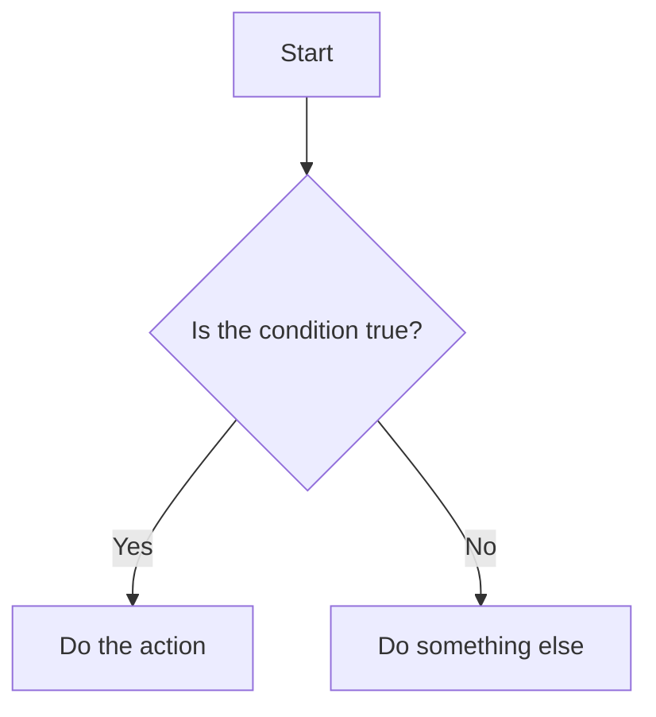

> Whether it’s ANDy checking rules or NORa debating feelings, logic flows like this.

---

### 🧪 Try This: Write Your Life as Logic
Pick 3 habits. Turn them into logic statements!

- "If I'm sleepy AND it’s night → Go to bed."
- "If I’m bored OR hungry → Open the fridge."
- "If NOT sunny → Wear a hoodie."

Think like ANDy — then question it like NORa.

---

### 💬 Final Thoughts: Brains and Bytes

Humans and machines both use logic — but in wildly different ways:

- 💡 Computers = fast, exact, rule-driven
- 💭 Humans = thoughtful, emotional, flexible

Still, they share the same starting point: **logic**.

> Logic is where minds — metal or mortal — begin to think.

---

### 🔍 Reflection Time
- When did logic help you make a smart choice?
- When did emotion override logic?
- What would life be like if you could only think in 0s and 1s?

Jot down your answers — or talk them out loud. You’re building your own logic system.

---

✅ Ready for the next step? In **Lesson 2**, we revisit a close friend from HAC101: **Binary!**

Let’s see how 0s and 1s fuel the logic you’ve just learned about...

---

### Lesson 2: *“Meet the Binary Brain Again”* — 0s, 1s, and the Digital Beat 🎵

> A follow-up to our binary journey in HAC101 — now with deeper connections to logic gates and how simple switches power everything digital.

---

#### 🎯 Learning Goal

Understand how **binary** works as the core language of computers. Explore how it links directly to logic gates and why 0s and 1s are more than just numbers — they’re **digital decisions**.

---

#### 🤔 Wait... What Is Binary Again?

Binary is a counting system with just **two digits**:
- `0` = OFF ❌ (No electricity)
- `1` = ON ✅ (Electricity flowing)

While humans use **base 10** (0–9), computers use **base 2**. Why? Because it matches perfectly with their electrical nature. It’s either **on** or **off** — no in between.

> Binary is like the heartbeat of a computer — a rhythm of yes/no, go/stop, on/off. It’s simple, elegant, and powerful.

---

#### 🧠 NORa Explains...

> “Binary may look boring... but it’s the spark behind every image, video, message, and app you’ve ever seen. Even my personality has binary roots!”

#### 🤖 ANDy Demonstrates...

> "Look: 00101010 — that’s the binary for the number 42. A computer doesn’t *see* a number. It sees a **pattern of signals**."

---

#### 🔄 Decimal vs Binary: A Quick Comparison

| Decimal (Base 10) | Binary (Base 2) |
|-------------------|------------------|
| 0                 | 0                |
| 1                 | 1                |
| 2                 | 10               |
| 3                 | 11               |
| 4                 | 100              |
| 5                 | 101              |
| 6                 | 110              |
| 7                 | 111              |
| 8                 | 1000             |

Each new digit in binary represents a **power of 2** (1, 2, 4, 8, 16...). Just like decimal uses powers of 10.

---

#### 🔌 How Binary Connects to Logic Gates

Every input into a logic gate is either a `0` or a `1`.

- A binary **`1`** means: “This signal is **true** or **active**.”
- A binary **`0`** means: “This signal is **false** or **inactive**.”

So when ANDy runs logic gates:
- `1 AND 1` → `1`
- `1 AND 0` → `0`
- etc.

It’s not just numbers. It’s **decisions**.

---

#### 🧮 Diagram: Binary → Logic Gate

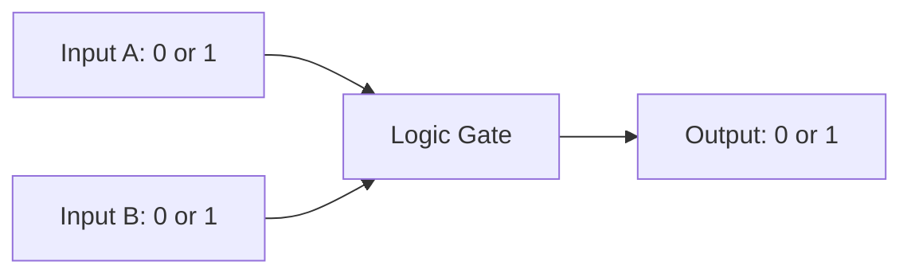

> Binary signals come in, the logic gate applies its rule, and a new binary signal comes out. Just like thought.

---

#### 👋 Try It Yourself: Finger Binary!

You’ve got **10 fingers**, right? Great! Let’s count in binary using only 4:

| Binary | Fingers        | Decimal |
|--------|----------------|---------|
| 0000   | 👇👇👇👇         | 0       |
| 0001   | 👇👇👇☝️         | 1       |
| 0010   | 👇👇☝️👇         | 2       |
| 0011   | 👇👇☝️☝️         | 3       |
| 0100   | 👇☝️👇👇         | 4       |
| 0101   | 👇☝️👇☝️         | 5       |
| 0110   | 👇☝️☝️👇         | 6       |
| 0111   | 👇☝️☝️☝️         | 7       |
| 1000   | ☝️👇👇👇         | 8       |

> 💡 Tip: The leftmost finger = the biggest value.

---

#### 💬 Final Thoughts: The Beauty of Simplicity

Binary is not just a code — it’s the **foundation of digital life**.

- Every emoji 😊, every text, every line of code — starts as 0s and 1s.
- Every logic gate makes decisions using these tiny signals.

> Computers don’t speak English or Persian. They speak **Binary** — the poetry of electricity. ⚡📘

---

#### 🧠 Reflection Time
- Can you think of something in your life that has just two options?
- How would you represent your feelings or decisions in just 0 and 1?
- Is it possible to simplify a human idea into just two states?

Write a few binary “thoughts” and see how it feels.

---

Next stop? **Logic gates in action!** 🔓
Time to meet: **AND, OR, NOT** — the original *Digital Trio*.

---

## 🧩 MODULE 1: Logic Gates – “The Thinking Circuits”

> Welcome to **Module 1**, where we dive into the very foundation of computer thinking: **logic gates**! These are the tiniest brains inside every computer. They don’t speak in words or pictures — they speak in logic.

Everything we explored in HAC101 and Module 0 — about input ➡️ processing ➡️ output — now takes physical shape in digital circuits. Each logic gate is like a tiny processor that receives **binary inputs** (0 or 1), follows its **unique rule**, and gives a binary **output**. This is the core of how computers "think".

Let’s begin with our first lesson:

---

### Lesson 1: “The Tiny Brains” – Meet the Gates!

> *"Even the smartest computer starts with a simple question: yes or no?"* 🌟

Welcome back, brainiacs! 🧠 Today we step into the thinking circuits of computers and meet their tiniest decision-makers: the logic gates! These little digital creatures take simple inputs (like 1s and 0s) and produce smart outputs based on logic rules.

---

#### 🧩 Wait — What’s a Circuit?

A circuit is like a tiny road system for electricity. It connects logic gates (and other components) using wires so that electricity can flow through them in a planned way.

Just like a race track has starting points, turns, and a finish line — a circuit has inputs, processors (like gates), and outputs.

When you put multiple gates together in a circuit, they become capable of doing complex thinking, like checking a password, counting, or even making music!

Every digital device you use — phones, watches, microwaves — all run on millions (or billions!) of these circuits working together. ⚡🧠

ANDy and XORa are back in the lab, ready to introduce us to their friends!

---

#### 🤖 Meet the Logic Gates!

Before we dive into each gate, let’s remember something from HAC101: **everything — even logic — follows the pattern of Input ➡️ Processing ➡️ Output**.

Each **logic gate** is like a mini processor. It takes input(s), applies a rule (its logic), and gives an output. Simple, right? But when millions of these gates work together, they power smartphones, rockets, and even this very course!

Each type of gate also has its **own shape** — kind of like a digital fingerprint — so engineers can recognize them in circuits just by their symbol.

Let’s meet these tiny decision-makers and see how they think!

##### 🔌 1. The AND Gate – *"Only if both!"*

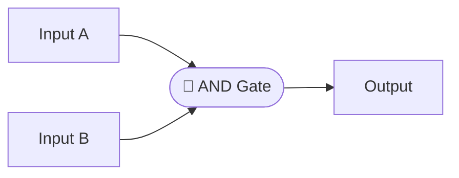

Think of the AND gate like a tiny logic processor. It takes **two inputs** — each one is either a 0 (off) or a 1 (on). Then it **processes** those inputs with a strict rule: it only outputs a 1 **if both** inputs are 1. Otherwise? You get a 0.

Simple, right? Just like we learned before: **Input ➡️ Processor ➡️ Output**.

And this little processor has a very serious personality...

**Personality:** Serious, strict, always needs full confirmation.

**Rule:** It only says YES (1) if **both** inputs are YES (1).

```
 A | B | AND Output
---|---|------------
 0 | 0 |     0
 0 | 1 |     0
 1 | 0 |     0
 1 | 1 |     1 ✅
```

**ANDy**: "He’s kind of named after me. Always double-checking!"

###### 🖼️ Visual Example

> In the image below, we see three states of the AND gate:
>
> - Both inputs off (0, 0) ➡️ Output stays red 🔴
> - One input on (1, 0) ➡️ Output is still red 🔴
> - Both inputs on (1, 1) ➡️ Output turns green 🟢
>
> This shows how AND only says YES when **both** conditions are true!


_AND only says YES when **both** conditions are true!_


---

##### 🌈 2. The OR Gate – *"At least one!"*


Like the AND gate, the OR gate is also a tiny processor. It takes **two inputs** — 0s and 1s — and then applies its own rule. But this one’s a little more relaxed!

It says YES (1) as long as **at least one** of the inputs is a 1. Even better? If both are 1, it still says YES. It’s like the gate that always wants to go to the party 🎉.

Just like we learned: **Input ➡️ Processor ➡️ Output** — with a much friendlier attitude!

**Personality:** Friendly, optimistic, says yes to almost everything.

**Rule:** It says YES (1) if **either** input is YES (1)... or both!

```
 A | B | OR Output
---|---|-----------
 0 | 0 |     0
 0 | 1 |     1 ✅
 1 | 0 |     1 ✅
 1 | 1 |     1 ✅
```

**NORa**: "She’s so easygoing! I love her vibe."

###### 🖼️ Visual Example

> Here's how the OR gate looks:
>
> - Both inputs off ➡️ Output is red 🔴
> - Any one input on ➡️ Output becomes green 🟢
> - Both inputs on ➡️ Still green 🟢
>
> It really is the friendliest gate — as long as **one** is on, you're good to go!


_As long as **one** is on, you're good to go!_


---

##### 🔄 3. The NOT Gate – *"The Flipper!"*

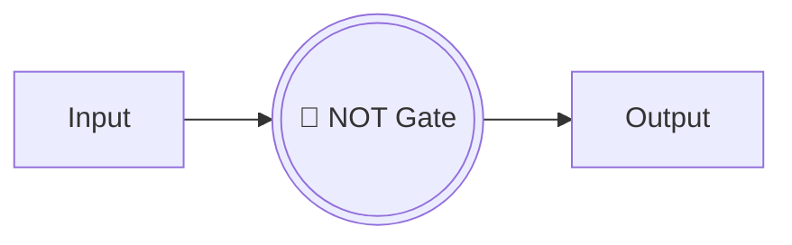

The NOT gate is a quirky little processor with a mind of its own. It only needs **one input** — just a single 0 or 1. Once it receives the input, it applies its magical rule: **flip it!** 😲

- If it gets a 0, it gives back a 1 ✅
- If it gets a 1, it gives back a 0 ✅

It’s like a little trickster that always does the opposite — but hey, it’s still following the logic: **Input ➡️ Processor ➡️ Output**!

**Personality:** Mysterious, always says the opposite of what you give.

**Rule:** Takes **one** input and flips it: 0 becomes 1, 1 becomes 0.

```
 A | NOT Output
---|-------------
 0 |     1 ✅
 1 |     0 ✅
```

**ANDy**: "He’s a trickster. Great at hiding passwords!"

###### 🖼️ Visual Example

> The NOT gate is simple but powerful:
>
> - Input is 0 ➡️ Output is 1 (green) ✅
> - Input is 1 ➡️ Output is 0 (red) ❌
>
> It flips the signal every time — always giving the opposite!


_Always giving the opposite!_


---

###### 🎁 Bonus: “Logic Snack” - Where Does the Power Come From? (feat. NORa & ANDy)

> *“How can the NOT gate turn on the output, if we give it nothing at the input?”*

Great question! Let's zoom inside the gate — with our friends NORa and ANDy! 🔍✨

---

**ANDy**: “Hey NORa, I heard a student ask — if we don’t give the NOT gate any power at its input… how does it make an output?”

**NORa**: “Ah! The input isn’t where the power comes from, silly. The gate has its own energy source — the power line from the chip!”

**ANDy**: “So it’s like… it has breakfast every morning before we even say anything?” 🍳

**NORa**: “Exactly! The input is like telling it to *do* something — but the power to act is already flowing through its circuits.”

---

###### ⚙️ Real Talk (Mini Tech Peek)

On real logic chips, like a 7404 inverter:
- Each NOT gate has **1 logic input pin**
- **1 output pin**
- And the whole chip shares a **Vcc (power)** and **GND (ground)** to keep everything energized ⚡

So when input is `0`, the gate **uses its power** to make output `1`.  
It’s not stealing energy from the signal — it’s **already plugged in**!

---

**NORa**: “Power goes in through the kitchen, not the front door!” 🍽️⚡  
**ANDy**: “And logic just tells us what to cook.” 😋

---

> ✅ Now you know: NOT gates are active little chefs.  
> No input = full power breakfast output! 🍳💡

---

#### 💡 How Computers Think with Logic Gates

Imagine you’re building a brain out of LEGO 🧱. Each logic gate is a block. By putting them together, we build thinking machines:

- Door locks
- Calculators
- Even AI systems! 🤖

Computers use **millions** of these tiny gates wired together to make smart decisions instantly.

---

#### 🎲 Try It Yourself!

Try experimenting with an open source logic simulator like [Hradla](https://janjaromirhorak.github.io/hradla/) — a browser-based tool where you can build your own circuits using AND, OR, and NOT gates. It's simple, fun, and totally free!

We also used **Hradla** earlier to create visual examples of each gate in action — those diagrams show how the inputs and outputs behave based on the logic rule applied. Whether it's flipping a signal with a NOT gate or waiting for both inputs in an AND gate, Hradla makes it easy to see logic in motion!

Try to:

- Use Hradla's **input boxes** to simulate signals and set them to 0 or 1.
- Observe how the **output boxes** show the result after passing through the logic gates.
- Experiment by combining gates to mimic the truth tables you've just learned.
- Create your own simple decision circuits — can you replicate a NOT gate that flips the input?

> Note: Hradla doesn’t use visual switches or lights, but input/output boxes work the same way!

---

#### 🔁 Wrap-Up

Today we met:

- The logical trio: AND, OR, and NOT
- Their personalities and truth tables
- How these simple rules make up all computer thinking!

Next up: we’ll **combine gates** and build our own mini brains. Get ready to connect the dots — literally!

**Stay logical! 🧠⚡**

---
### Lesson 2: “Combining Gates” – Building Tiny Machines

> *"What happens when tiny brains work together? They build something bigger — like your own logic-powered LEGO set!"* 🧩🧠

In this lesson, we’ll explore what happens when we **combine logic gates** — the digital equivalent of connecting ideas. Just like humans use multiple thoughts to make complex decisions, computers use **multiple gates** to form circuits that can compare, calculate, and remember.

---

#### 🎯 Learning Goal

Understand how combining basic gates like **AND, OR, and NOT** allows us to build **circuits** that can solve more advanced problems. Learn to trace these combinations and recognize how computers build logic layer by layer.

---

#### 🛠️ Logic Gate Recipes

Think of each gate like an ingredient — on its own it’s useful, but together? Delicious logic stew! 🍲

##### 👇 Example 1: "Only if both, but not always"

We want a circuit that:

- Only gives a YES (1) if both inputs are on (like AND)
- But then flips the result (like NOT)

That’s just: **AND ➡️ NOT**

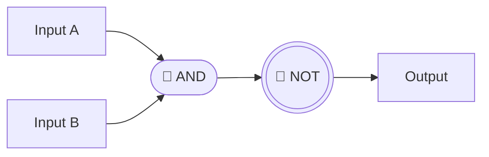

This combo is also known as a **NAND gate** — AND + NOT. It’s one of the most useful gates in real-world computers!

##### 🧠 Real-World Thinking:

Here’s a peaceful example of **NAND logic** in daily life:

> **“I’ll stay relaxed unless I’m tired AND it’s noisy.”** 🧘‍♀️🔇

- If I’m not tired, or if it’s quiet, I remain calm ✅
- But if I’m **both tired and it’s noisy**, I get stressed ❌

This matches the NAND gate — only **false** (not relaxed) when both conditions are true.

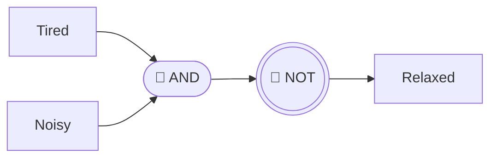

> You’ve just modeled inner peace with logic gates!

- “I’ll go out **only if** it’s sunny AND I’m not tired.”

This sentence is a great example of **logic in layers** — we’re actually using a **NOT** gate and an **AND** gate together:

- "Sunny" is one input ✅
- "Tired" goes through a NOT gate → becomes "Not tired" ✅
- Both are fed into an AND gate → Output = YES (Go out!) ✅

#### 🧠  Diagram

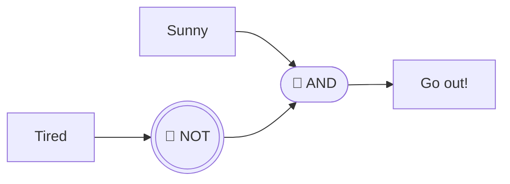

> This mirrors how computers handle conditions step-by-step — just like us!

- Two thoughts. One final decision. That’s logic stacking — human style!

---

#### 🎯 Challenge Example: OR with a Twist

What if we want:

- Output is YES if either input is on — BUT NOT if both are on?

That’s an **Exclusive OR**, or **XOR**!

We can build it with a combo like this:

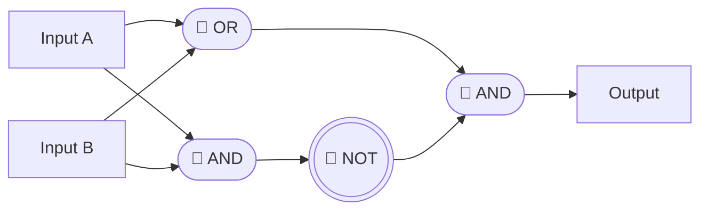

> It might look like a puzzle — and it is! But you’re starting to think like a circuit designer 🔧🧠

---

#### 🔁 Human Parallels

We combine logic all the time without realizing it:

- “If I have money AND I want pizza, but NOT if I’m on a diet...” 🍕💸❌
- “If it’s the weekend OR a holiday AND the weather is good, I’ll go hiking.” 🥾🌞

Humans mix thoughts just like gates mix signals.

---

#### 🧪 Try It Yourself (in Hradla!)

Create:

- A **NAND gate** using AND + NOT
- A basic **XOR** using AND, OR, and NOT
- Make your own mini decision circuit — like "Do I play games or study?"

---

#### 💬 Final Thoughts

Just like LEGO, combining tiny pieces builds something greater. You’ve now built logic circuits — the blueprint behind everything digital.

Next time, we’ll see how logic expands beyond the personal… into the **social lives** of circuits and humans!

> Logic is not just rules — it’s relationships. ❤️🔌

---

### Lesson 3: “Logic in Our Heads” – and in Our Social Lives

> *“Logic doesn’t just live inside machines — it lives in how we talk, decide, and care.”* 🧠💬❤️

Welcome to a special kind of logic — the kind that exists in **humans**, **relationships**, and **everyday decisions**. In this lesson, we’ll explore how **human logic** compares to **digital logic**, and how both can clash or cooperate in fun (and sometimes funny!) ways.

---

#### 🎯 Learning Goal

Discover how logical structures like AND, OR, and NOT appear in human behavior and social dynamics. Learn to reflect on how emotions, assumptions, and relationships influence — and sometimes override — strict logic.

---

#### 🧠 Logic Isn’t Just for Circuits

Let’s break it down:
- Computers use logic gates to make **fast and strict decisions**
- Humans use a mix of logic, emotion, memory, and experience to make **flexible, context-aware decisions**

But the patterns are surprisingly similar:

| Situation                             | Human Logic Statement                              | Logic Gate Match |
|--------------------------------------|-----------------------------------------------------|------------------|
| Choosing a movie                     | If I’m tired OR I want to relax → Watch something  | OR               |
| Avoiding an argument                 | If I’m upset AND they’re upset → Stay silent       | AND              |
| Encouraging a friend                 | If they’re sad → NOT tease them                    | NOT              |

---

#### 👨‍👩‍👧‍👦 Social Logic: Group Decisions

Imagine a group of friends deciding on pizza:
- **AND-style**: Everyone must agree before ordering 🍕
- **OR-style**: If anyone wants it, they order
- **XOR-style**: Only order if exactly one person wants it 😅

See how gates become personalities?

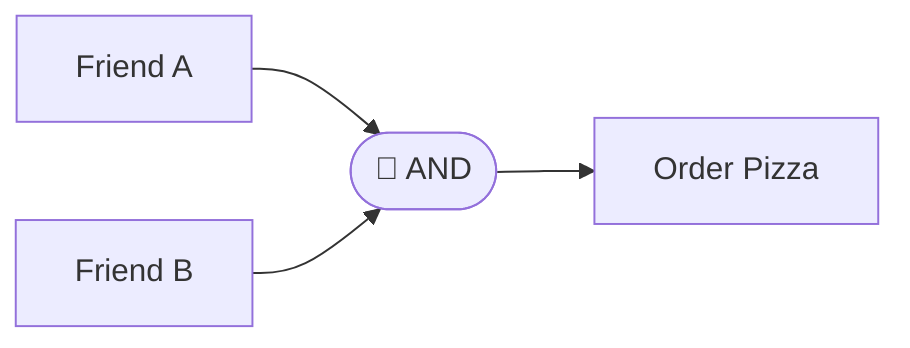

> This is how digital logic helps us visualize human group behavior!

---

#### 🤯 Emotional Overwrites

Sometimes, logic says one thing — but our hearts say another:
- “I know it’s not logical… but I just *feel* it’s right.”
- “Technically it’s fair, but it doesn’t *feel* kind.”

Humans are **living circuits with feelings**, and that makes us beautifully unpredictable 💗

---

#### 🧠 Humans Think in Logic + Emotion

Sometimes, humans go even one step further: we act **even when logic says NO**, just because our **hearts say YES**. ❤️🆚🧠

This happens in moments like:
- Falling in love with someone unexpected 💘
- Forgiving someone who doesn’t deserve it on paper 🤝
- Taking a chance on a dream despite the odds 🌠

In these moments, emotion **overpowers** logic. And instead of using an AND gate, it’s like we’re using a special gate:

> **If Emotion = YES, then Act — even if Logic = NO**

You might call this a **“Heart Gate”** 💖

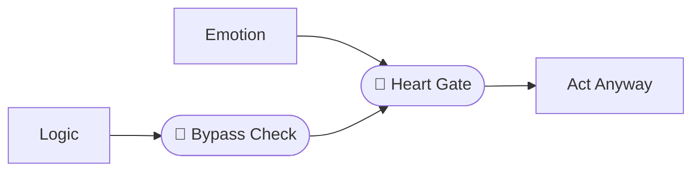

> This might not be logical to a machine… but it’s deeply human.

Now, back to our more balanced circuits:

Many of our real-life decisions follow a special kind of inner circuit:

> **Logic AND Emotion → Action**

We often won’t act unless something **makes sense AND feels right**.

##### 💡 Example:
> “Should I take this job?”

| Logic (Thought) | Emotion (Feeling) | Result          |
|------------------|--------------------|-----------------|
| ✅ Makes sense   | ❌ Doesn’t feel right | 🚫 Don't act     |
| ✅ Makes sense   | ✅ Feels exciting     | ✅ Go for it!    |

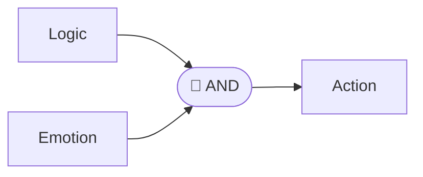

> If both Logic AND Emotion say YES, we act. But if either one says NO, we pause.

This is why humans often appear to be **“illogical”** to computers — we’re adding **feelings** into the circuit! ❤️🔌


**NORa**: "Shouldn’t we also consider how people *feel* when we use logic?"

**ANDy**: "Feelings don’t follow rules. But… maybe some rules should follow feelings."

**NORa**: "That’s the most logical thing you’ve said all day!"

---

#### 🧪 Try This!
Think about a recent decision you made.
- Was it purely logical?
- Did emotion change your outcome?
- Could you map it using AND, OR, or NOT?

Draw your logic circuit… then add your heart as an input 💖

---

#### 🧠 Final Thoughts

You’re not a robot (even if you think like one sometimes). Logic is your **thinking tool**, but your **humanity is your compass**.

> In every moment of connection, there’s a little logic… and a lot of heart ❤️🔌

---

### Lesson 4: “Circuits with a Purpose”  – Combining Logic for Real Decisions

> *“Simple rules, when connected, create powerful decisions — just like us.”* 🔌🧠✨

Now that we’ve met the individual logic gates and explored how humans sometimes think like them, let’s see what happens when we **combine** these gates to make more complex decisions. Welcome to **circuits** — the heart of both computer thinking and structured human decisions!

---

#### 🎯 Learning Goal

Understand how logic gates combine to create circuits that can model real-world decisions — both mechanical and human.

---

#### 🧩 What Is a Logic Circuit?

A **logic circuit** is just a group of gates working together. Instead of one simple rule (like AND or OR), circuits allow us to build more **thoughtful systems** — like an alarm, a voting machine, or even... a conscience.

Each gate takes input, does its job, and passes output to the next gate — like passing a note in class that everyone edits.

---

#### 🧭 Real-World Example: Should We Go On a Trip?

Let’s say a group of friends wants to go on a trip. But:
- The weather must be **sunny** ☀️
- At least **one person must be free** 🧍
- And the car must have **enough gas** ⛽

We can model this as a circuit!

##### 🔘 Inputs:
- `Weather = Sunny` → ✅ or ❌
- `Friend1_Free OR Friend2_Free` → ✅ or ❌
- `Car_Has_Gas` → ✅ or ❌

##### 🔁 Circuit Flow:
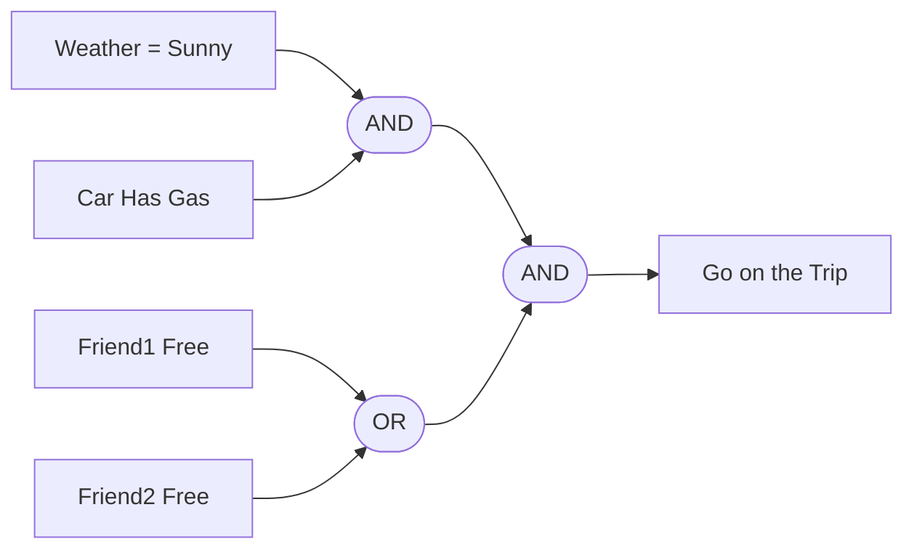

> This is a real logic circuit — but also a real human plan!

| Weather | Friend1 Free | Friend2 Free | Gas | Result        |
|---------|--------------|--------------|------|----------------|
| ✅      | ❌           | ✅           | ✅   | ✅ Go on trip! |
| ✅      | ❌           | ❌           | ✅   | ❌ Stay home   |
| ❌      | ✅           | ✅           | ✅   | ❌ Stay home   |


---

#### 🧠 Why This Matters

Computers use circuits to:
- Decide if a password is correct 🔐
- Choose which lights turn on 🚦
- Play sounds, draw shapes, or run apps 🎵📱

Humans use circuits (mentally) to:
- Make group decisions
- Weigh multiple conditions before acting
- Avoid risks and look for green flags ✅🚩

Circuits help us **process many inputs into a single, smart output**.

---

#### 🧠 Brain Circuit Bonus: Human Checklists

Have you ever made a mental checklist like this?

> "Did I bring my keys? Wallet? Phone? Am I wearing pants?"

That’s a circuit!

If **all** conditions are true → ✅ Leave the house

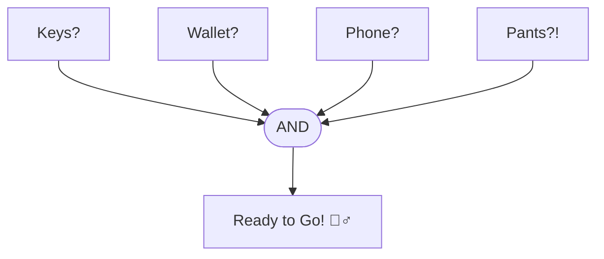
##### 🔌 How That Works:

Most basic logic gates are shown with two inputs for simplicity. But in physical hardware and integrated circuits, logic gates can be manufactured to accept 3, 4, or even more inputs directly.

For example:

- A 3-input AND gate will output 1 only if all three inputs are 1.
- A 4-input AND gate works the same — all four must be 1 for the output to be 1.

---

#### 🧪 Try This!

Create a circuit from your own life:
- Deciding what to eat 🍲
- Choosing a friend to call 📞
- Whether or not to hit "Send" on that message 😅

Draw the inputs and the gates. Where do your emotions sneak in?

---

#### 💬 From NORa & ANDy:

**ANDy**: "One gate alone can’t do much. But connect a few, and you get a full conversation."

**NORa**: "Just like people! We’re all little processors working better together."

---

#### 🧠 Final Thoughts

Every thoughtful action — whether from a circuit or a soul — is made of **small decisions connected together**.

Computers do it with electrons. Humans do it with experience, logic, and heart 💡❤️

> Next up: **Memory Circuits** — how computers and humans remember things.

Ready to remember? Let’s go to Lesson 5!

---

### Lesson 5: “Memory and the Power of State”

> *“To remember is to store. And to store is to loop.”* 🔁🧠💡

Now that we’ve seen how logic gates can make decisions, let’s explore how they can also **remember** things. This is the key to **memory**, **storage**, and even **identity** in both computers and humans.

---

#### 🎯 Learning Goal

Understand how circuits can hold a value over time — and how this creates memory in computers (and patterns in human thought).

---

#### 🛌 Memory While We Sleep – RAM vs. Long-Term Memory

Ever wondered what happens to your memories when you sleep? It turns out that human memory works a bit like a computer too.

During the day, your brain stores new information in something like **short-term memory** or **working memory** — a bit like how computers use **RAM (Random Access Memory)**. It’s fast, active, and holds lots of information while you’re awake.

But here’s the thing: **RAM is temporary**. When a computer shuts off, everything in RAM is gone unless it’s saved to the hard drive. And our brains? They do something similar!

When you go to sleep, your brain **cleans up** this temporary memory:

- Some memories fade away (like unsaved work 🗑️)
- Others get written to **long-term memory** — like saving to a hard drive 💾

How do we "save" them?

- By **repeating** information (like reviewing a lesson or saying a phone number out loud)
- By attaching **emotion** or meaning (important memories stick better)
- By **sleeping**, which helps consolidate what we learned

> 🧠 Your brain has a nightly backup system! Only what was truly repeated, meaningful, or emotionally marked makes it into long-term storage.

So yes — your short-term memory needs electricity and attention (like RAM). And your long-term memory? That’s your brain’s hard drive.

---

#### 🧠 Human Memory and Feedback

Before we go full circuit-mode, let’s take a moment to remember: **humans store memory in loops too**.

🧠 When we repeat a phone number out loud — "0935... 0935..." — we’re creating a **mental feedback loop**. We’re sending that information from short-term to long-term memory by **looping it in our minds**.

💬 When a strong emotion or a habit reinforces a moment, it becomes easier to remember — much like how a memory circuit (which we’ll soon explore as a flip-flop) reinforces its state by looping the output back into itself.

Just like a logic gate needs a little signal to change what it remembers, humans often need a **trigger** — a smell, a song, a face — to reset or reinforce what they remember.

🌀 We loop thoughts to retain memories, we loop routines to reinforce identity. So when you see a circuit holding a 1 or 0, think of your brain holding on to a moment. It’s not just electrical — it’s deeply human.

A memory circuit is one that **remembers its previous state**, even when inputs are removed or changed. It can be used to:

- Store a number
- Remember if something has happened (a button pressed, a door opened)
- Hold a mode or setting (light on/off)

---

#### 🧠 Bonus Concept: “Meet the NOR Gate” (featuring NORa!)

Before we dive deep into flip-flops, let’s take a moment to meet one of their key parts: the NOR gate — and our quiet-thinking companion, NORa! 👩‍✨

NORa is shy but smart. She only says YES when everyone else is completely quiet. She doesn’t like noise or chaos — she’s all about peace and clarity.

She runs the circuits of memory with grace, making sure nothing changes unless it absolutely has to. A quiet guardian of digital calm, always listening for silence before giving her gentle nod.

The **NOR Gate** only outputs `1` if **both** inputs are `0`.

```
 A | B | XOR Output
---|---|-------------
 0 | 0 |     1 ✅
 0 | 1 |     0 ❌
 1 | 0 |     0 ❌
 1 | 1 |     0 ❌
```

That’s why NOR gates are so good for memory — they *only* respond when everything else is quiet.

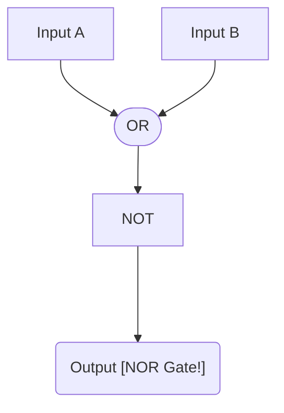

> 👩‍🏫 Think of the NOR gate as the cautious thinker: “I’ll only say YES if **nobody else is talking.**”

---

#### 🔁 Enter the Flip-Flop

Let’s explain this in simple terms — imagine you're trying to create a tiny memory, a 0 or 1, using **pure logic**.

A **flip-flop** is like a switch that remembers if it was turned on or off. It does this by using **two NOR gates** wired together in a special way — creating what’s called a **feedback loop**.

That means each gate’s output becomes part of the input to the other gate. As long as electricity is flowing, this loop keeps repeating the output to itself, locking in the value like an echo.

---

#### 🧠 How It Stores a Bit

The flip-flop has two inputs:

- `S` = **Set**, to store a `1`
- `R` = **Reset**, to store a `0`

And two outputs:

- `Q` = the memory state (what we want to remember)
- `nQ` = the opposite of Q (just for reference)

##### How it works:

- If you turn **Set = 1**, the output `Q` becomes `1` and stays that way even after you release the Set signal.
- If you turn **Reset = 1**, the output `Q` becomes `0` and stays that way.

The secret? The **output loops back** into the inputs of the opposite gate, reinforcing the value continuously.

👉 As long as both `S` and `R` are `0`, nothing changes. The flip-flop **holds** its value.

But to change what’s stored, you give it a new signal using either Set or Reset — and it flips to the new state and locks in again.

This is how **a loop of electricity can store a bit**. It's the basic building block of all digital memory: from RAM to registers to neural-style circuits.

Now let’s look at it in action:

One of the simplest memory circuits is called a **Flip-Flop**. It stores just **one bit** of data: a 0 or a 1.

Let’s meet the **SR Flip-Flop** (Set-Reset Flip-Flop):

🔘 Inputs:

- **S** – Set: Tries to make the output 1
- **R** – Reset: Tries to make the output 0

⚙️ Outputs:

- **Q** – The stored value (1 or 0)
- **Not Q** – The opposite of Q

It’s like a latch: you **Set** it to 1 or **Reset** it to 0. Then, it **holds** that value until you change it.

Here’s how it works:

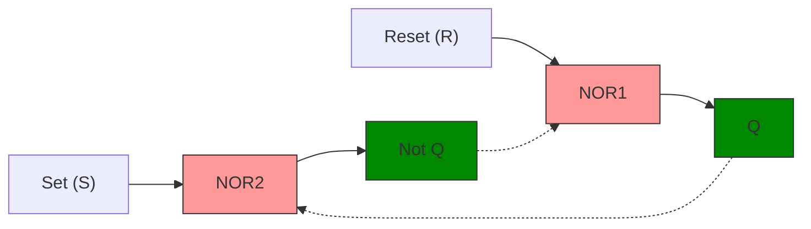

🔁 The dashed arrows show the **feedback loop**: the outputs of the gates loop back into the opposite gate’s input. This is what allows the flip-flop to "remember" its state even after the Set or Reset signal is removed.

---

#### 🧪 How It Works – Step by Step

##### 🔍 Deep Dive: What Actually Happens During Set?

Let’s zoom in on what happens **step by step** when we apply `S=1` and `R=0`:

1. `S=1` and `R=0` → NOR2 receives `1` and feedback from Q → **output = 0 (nQ)**
2. NOR1 receives `0` from R and `0` from nQ → **output = 1 (Q)**
3. Q feeds back to NOR2, reinforcing `nQ = 0`
4. Even after `S` becomes 0 again, Q remains at 1 because of the loop

✅ The state is now **stored**.

The magic is in the loop: each gate’s output affects the other, and that **locked cycle** keeps the value stable until a new command is given.

##### 🟢 1. **Set (S=1, R=0):**

Let’s break it down simply:

- `S = 1` means we want to **store a 1**.
- NOR2 receives `S = 1`, so its output `nQ = 0`.
- NOR1 now receives `R = 0` and `nQ = 0` → which means its output `Q = 1`.
- That `Q = 1` loops back into NOR2, helping it keep `nQ = 0`, even after `S = 0`.

✅ The flip-flop now stores a `1` — and will keep storing it thanks to the **feedback loop**.

Here's a visual to help:


> 🧠 Now `Q = 1` is stable, and the circuit “remembers” that Set input, even after it turns off. That’s what makes this a memory device!

---

##### 🔴 2. **Reset (S=0, R=1):**

Let’s break it down simply:

- `R = 1` means we want to **clear** the memory. That is, store a `0`.
- NOR1 receives `R = 1`, so its output **Q becomes 0**.
- Q now loops back into NOR2, which also has `S = 0`, so NOR2 outputs `1` — making `nQ = 1`
- This result (nQ = 1) loops back into NOR1 and helps hold Q at 0, even after `R` goes back to `0`.

✅ The flip-flop now stores a `0` — and will keep storing it thanks to the **feedback loop**.

Here's a visual to help:

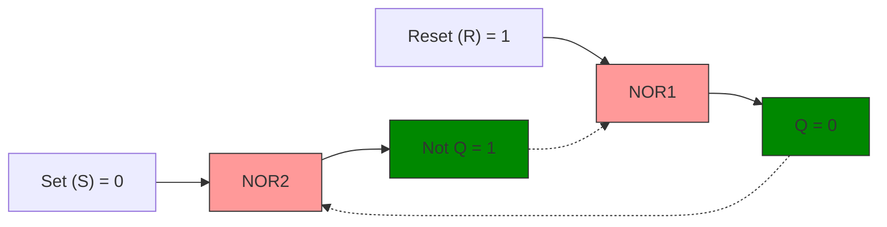

> 🧠 Notice how `Q = 0` is now stable, and the circuit “remembers” that reset, even after `R` is off. That’s the power of feedback!

---

##### ⚪ 3. **Hold (S=0, R=0):**

Let’s break it down simply:

- Neither `S` nor `R` is active.
- So neither NOR gate is forced to change.
- Each output continues feeding into the other gate just like before.

If we had stored `Q = 1` before, it stays `1`. If it was `Q = 0`, it stays `0`. The **feedback loop holds** whatever was last stored.

📌 **Important Note:** This "hold" state only works **after** a state has already been set or reset. If you power on the flip-flop with both `S=0` and `R=0`, the state is **undefined**, because the gates haven't received any instruction yet.

✅ **Memory held**

Here's a visual showing the hold state (assuming Q = 1 was stored):

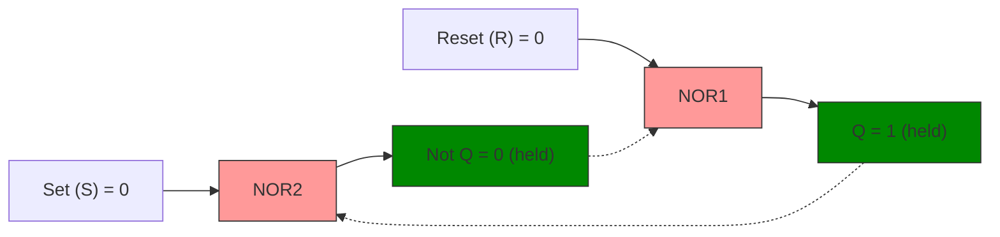

> 💡 This is the magic of memory: the loop is strong enough to “echo” the state until something else changes it.

In real-world circuits, we always **start** with either `Set` or `Reset` to initialize the memory properly.

- The outputs `Q` and `nQ` just **stay the same** as they were, thanks to the feedback loop.

✅ **Memory held**

---

##### 🛑 4. **Invalid (S=1, R=1):**

- Both NOR gates are told to output `0`, which breaks the rule that Q and nQ should be opposites!
- It leads to **unstable or undefined behavior**.

❌ **Don’t do this!**

---

#### 🧠 Why This Works

The genius is in the **feedback loop** — each gate gets input from the **other**. That means the state kind of “locks” itself in.

As long as neither `S` nor `R` tries to force a new state, the outputs keep themselves going in a little self-sustaining logic cycle.

This is the core of **memory** — not just in flip-flops but in RAM, CPUs, and even in how human neurons might echo patterns over time. 🤯

---

#### 🧠 Final Thought

A flip-flop is like a tiny brain cell. With enough of them, you can build a machine that **remembers everything** — or even pretends to be alive.

> Next up: Circuits That Think — How patterns and logic become **decisions** over time.

Are you ready to meet memory's best friend: the clock? 🕰️

---

### Lesson 6: "Circuits That Think" – Timing, Memory, and the Clock

> "Even the smartest thoughts need good timing."

We’ve built circuits that can **remember**, but how do we make them **think step by step**? Enter one of the most important inventions in computer logic:

#### 🕰️ The Clock.

A clock is like the **heartbeat of a computer**. It ticks at a steady rhythm, telling all the circuits when to start, when to stop, and when to listen. Without it, our logic would be wild, noisy, and chaotic.

---

#### 🎯 Learning Goal
Understand how a clock signal controls the timing of memory and logic in computers, and how it compares to human rhythms and decision-making.

---

#### ⏰ What Is a Clock in a Circuit?

It’s not a wall clock! In digital electronics, a **clock** is a repeating signal (usually switching between 0 and 1) that provides **timing** for actions inside a circuit.

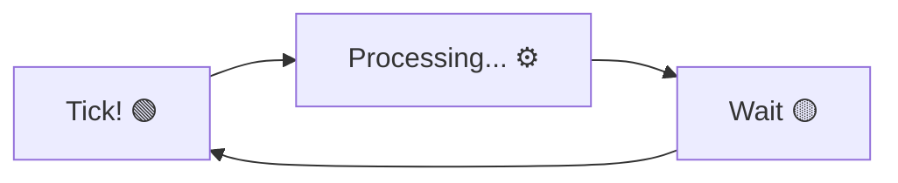

Every "tick" is like saying:
> "Ready, go!" 🏁

Between ticks, the circuit **holds** its state — just like you might think about your answer before speaking.

---

#### 🧠 Human Parallel: Our Mental Clock

Humans have timing systems too!
- We follow daily rhythms (circadian clock ⏳)
- We wait for our turn to speak in a conversation 🗣️
- We reflect before responding (hopefully 😅)

A well-timed thought or action is **more effective**. Just like circuits, we benefit from a **controlled pace**.

> Good logic is powerful.
> Timed logic is unstoppable. ⚡

---

#### 🔄 Meet the Clocked Flip-Flop

We can modify our flip-flop so it **only changes state when the clock ticks**. This is called a **clocked flip-flop** (also known as an edge-triggered flip-flop).

This makes sure that **no accidental changes** happen in between — only during that perfect moment.

```mermaid
flowchart LR
    CLK[Clock ⏰] --> Gate1([AND])
    Data[Input] --> Gate1
    Gate1 --> FF[Flip-Flop 🧠]
    FF --> Output[Stored Bit]
```

🧠 The data enters the flip-flop **only when the clock signal allows it** — like a teacher calling your name before you answer.

---

#### 🗣️ ANDy and NORa Reflect

**ANDy**: "Without the clock, I'd be changing my mind all the time."

**NORa**: "Timing helps thoughts become actions. I love a good rhythm! 🕺"

---

#### 🔬 Try This

Think of a moment when **you waited** before making a decision:
- Did you pause before speaking in a meeting?
- Did you sleep on a tough choice?
- Did you wait for the right time to share an idea?

That pause... that **internal clock**... was your timing circuit at work. 🧘‍♀️🧠

---

#### 🧠 Final Thought

Memory is power.  
Logic is structure.  
**But timing is what makes it all work.**

The clock helps circuits think with rhythm.  
And you? You have your own internal clock, your own pacing, your own timing.

> Next up: Looping Logic – when output becomes input again!

Stay in rhythm. The journey continues. 🔁

---

## 🔄 Module 2: “Feedback & Loops” – When Outputs Think Back

> *"What if logic could react to itself?"*

In this module, we move beyond simple logic gates and start exploring **systems that grow, react, and adapt over time**.

Feedback is everywhere:
- In your thoughts
- In your habits
- In your circuits and devices

Whether it’s a thermostat, a flip-flop, or a person learning from their mistakes, **feedback** is the mechanism that turns logic into something **alive**.

This is where logic starts to feel human.

Let’s begin.

---

### Lesson 1: “Feedback Loops 🔁” – Echoes of Thought

> *“What goes out... might come right back in.”* 🔄🧠

We've seen how logic gates make decisions, how memory circuits store information, and how clocks give everything rhythm. Now it's time to explore something deeper:

#### ➰ Feedback Loops

> *"A loop is not just repetition — it's transformation."* 🔁🌱

A feedback loop is when **the output of a system becomes its own input**. This might sound simple, but it’s the beginning of:
- Memory
- Learning
- Habits
- Overthinking 😅

Let’s dive in!

---

#### 🎯 Learning Goal
Understand how feedback loops shape the behavior of circuits — and how they mirror human emotions, habits, and thoughts that repeat.

---

#### 🔄 What Is a Feedback Loop?

Imagine a microphone in front of a speaker. You say something... and it gets picked up again... and amplified again... and again... until... 😵 *EEEEEK!* (ear-splitting screech).

That’s a **feedback loop**.

In circuits, feedback loops:
- Let a system remember its own output
- Let memory circuits like flip-flops keep their value
- Can be helpful or dangerous if not managed

```mermaid
flowchart LR
    A[Input] --> B[Logic Gate] --> C[Output]
    C -.-> A
```

> The dashed arrow shows the output looping back to become a new input.

---

#### 👩‍💻 Human Parallel: Habits and Emotions

Humans have feedback loops too:

- **Thought ➡ Feeling ➡ Action ➡ Reaction ➡ Thought again...**
- You smile → someone smiles back → you feel good → you smile more 😊
- You worry → notice more bad signs → feel more anxious → worry more 😬

These are **emotional loops** — and they help us grow, learn, or get stuck!

> Some loops lift us up.
> Some loops wear us down.

Being aware of our loops helps us **break bad ones** and **build good ones** — just like designers manage loops in circuits.

---

#### 🔁 Types of Feedback

##### ✅ Positive Feedback
- Reinforces itself
- Grows or escalates
- Good for alarms, boosting signals, confidence!

##### ⚠️ Negative Feedback
- Reduces or balances a change
- Stabilizes the system
- Good for control systems, cooling, humility!

```mermaid
flowchart TD
    P1[Positive Feedback Loop]
    P1 --> P2[Same Direction ➡ More!]
    P2 --> P1

    N1[Negative Feedback Loop]
    N1 --> N2[Opposite Direction ➡ Balance]
    N2 --> N1
```

---

#### 🗣️ ANDy and NORa Reflect

**ANDy**: "Sometimes I can’t stop thinking about my circuits..."

**NORa**: "Loops are powerful — but they need love and limits."

**ANDy**: "Like thinking a good thought again... or turning a worry into a loop."

**NORa**: "Exactly. A well-tuned loop is a beautiful thing."

---

#### 🧠 Try This

Think of something you repeat often:
- A morning routine ☕
- A phrase you say a lot 🗯️
- A thought you return to again and again

Is it a helpful loop? A harmful one? A habit?
Can you map it like a flowchart?

---

#### 🧠 Final Thought

Feedback loops give systems — and people — **memory, rhythm, and identity**.

Whether it’s a smart thermostat, a thinking brain, or a worrying mind, feedback defines how systems evolve.

> Next up: **Habits, Triggers, and Emotional Loops** – how our feelings are wired with logic.

Stay aware. Stay grounded. Stay curious. 🔄✨

---

### Lesson 2: “Habits, Triggers, and Emotional Loops”

> *"Emotions are logic with a memory."* ❤️🧠

Last time, we explored feedback loops — those amazing systems where outputs loop back as new inputs. But in humans, these loops don’t just involve logic — they involve **feelings**.

Let’s explore the connections between habits, emotions, and feedback, and how these inner loops shape who we are.

---

#### 🎯 Learning Goal
Understand how emotional triggers and habits function like logical loops, and how feedback creates behavior patterns in both people and circuits.

---

#### 🌱 How a Habit Begins

Imagine this:
- You drink tea one evening 🍵
- It feels cozy and calm
- Your brain stores that experience
- The next evening? You crave tea again!

Boom — the start of a **habit loop**.

A habit has three parts:
1. **Trigger** – Something happens (e.g. time of day, emotion)
2. **Action** – You respond (e.g. drink tea)
3. **Feedback** – You feel good or bad

> Repeat that enough... and the brain wires it together! 🧠🔁

---

#### 💡 Emotional Loops

Now let’s add **feelings** to the mix:
- You feel anxious 😟
- You scroll your phone 📱
- You feel distracted or rewarded 😌
- But later, more anxious... so you scroll again 😬

This loop feeds itself — like a feedback loop with a twist of emotion.

> These emotional loops aren’t bad.  
> They’re **human**. And when we understand them, we can reshape them.

---

#### 🧠 Brain Meets Circuit

Let’s break it down in a friendly diagram:

```mermaid
flowchart TD
    Trigger([Trigger: Feeling or Event]) --> Action([Action: Habit or Reaction])
    Action --> Result([Result: Feeling Again])
    Result --> Trigger
```

See that loop? Humans run logic too — but with flavor!

---

#### 🛠️ Circuit Comparison: State Machines

In circuits, we can design systems called **state machines** that:
- Wait for a trigger (like a button press)
- React (change a light, sound an alarm)
- Move to a new state (ready for next input)

Same loop. Just no feelings. 😅

---

#### 🧑‍🤝‍🧑 ANDy and NORa Reflect

**NORa**: "I get sad when I lose power... but I always bounce back."

**ANDy**: "When I see a pattern, I want to repeat it."

**NORa**: "That’s okay! Loops are how we grow — but we also get to choose which ones we keep."

---

#### 🧠 Try This

Map one of your loops:
- What's the trigger?
- What action do you take?
- What result do you feel?

Can you swap just one part?
- A different action?
- A better feeling?

> Tiny changes in the loop can change your entire system 🌈

---

#### 🧠 Final Thought

Habits and feelings aren’t random — they’re patterns.
And like any circuit, **they can be redesigned**.

> Next up: **Real Circuits That Learn – Intro to State Machines**

Stay thoughtful. Stay kind to your loops. 🔄❤️

---

### Lesson 3: “Real Circuits That Learn” – Intro to State Machines

> *“If this happens, go there. If that happens, stay here.”*

Welcome to the next step in our journey: **State Machines** — the hidden engine behind elevators, traffic lights, and even games.

They’re simple, smart, and shockingly similar to how we make decisions as humans.

---

#### 🎯 Learning Goal
Understand what a state machine is, how it works in both digital circuits and everyday choices, and how it relates to feedback loops.

---

#### 🔄 What Is a State Machine?

A **state machine** is a system that:
1. **Starts in a state** (like "Idle")
2. **Receives an input** (like a button press)
3. **Moves to a new state** (like "Active")
4. **Repeats this process** based on rules

It’s like a little brain with rules like:
> If you’re in State A and Input X happens → go to State B

---

#### 🚦 Real-Life Example: A Traffic Light

```mermaid
flowchart TD
    Red[Red Light] -->|Timer| Green[Green Light]
    Green -->|Timer| Yellow[Yellow Light]
    Yellow -->|Timer| Red
```

Each light is a **state**.  
The **timer** is the input.  
The lights loop in a logical pattern — no feelings involved. 😄

---

#### 🧠 Human Parallel: Modes of Behavior

Humans also switch states:
- Hungry 😋 → Eat → Full 😌
- Tired 😴 → Sleep → Awake ☀️
- Calm 😌 → Get startled → Alert 😳

We have triggers, states, and transitions — like built-in state machines.

---

#### 🕹️ Another Example: A Game Character

```mermaid
flowchart LR
    Idle -->|Press Jump| Jumping
    Jumping -->|Land| Idle
    Idle -->|Press Wave| Waving
    Waving -->|Cooldown| Idle
```

This structure is everywhere in games, websites, apps, and our own lives.

---

#### 🔧 In Circuits

Digital devices use **finite state machines** (FSMs) to control sequences:
- Vending machines 🍫
- PIN locks 🔐
- Phone menus 📞

Each input moves the system to the next appropriate state.

---

#### 🤝 ANDy and NORa Reflect

**ANDy**: "I love how structured state machines are. It’s like following a plan."

**NORa**: "And yet, just like us, they sometimes loop or pause — waiting for the next move."

---

#### 🧠 Try This

Can you think of your own mini state machine?
- What are 3 states you go through in your morning routine?
- What triggers each transition?

Draw it out — even with emojis!

---

#### 🧠 Final Thought

State machines give logic a story — a sequence.
They teach computers how to move through life, one state at a time.

And you? You’re a beautifully complex machine, learning when to pause, shift, and reset.

> Next up: **Pattern Recognition and Repetition** – how loops become learning.

Stay curious, stay dynamic. 🔁🤖✨

---

### Lesson 4: “Pattern Recognition and Repetition” – How Machines (and Minds) Learn

> *“Repetition isn’t just repeating — it’s learning to expect.”*

Welcome to the final lesson in Module 2! In this chapter, we’ll explore how circuits and humans learn through **repetition** and how recognizing **patterns** is the first step toward intelligence.

---

#### 🎯 Learning Goal
Learn how repetition and patterns allow both machines and humans to make predictions, adapt to new situations, and simulate learning behavior.

---

#### 🧩 What Is a Pattern?

A pattern is anything that happens more than once — **with meaning**.
- Day → Night → Day → Night 🌞🌚
- Hello → Smile → Hello 😊
- Button → Beep → Button → Beep 🔘🔊

Your brain spots these and thinks: “Hey, I’ve seen this before!”

Machines can be designed to do the same.

---

#### 🧠 Human Pattern Spotting

Humans are **pattern machines**:
- We recognize faces, rhythms, behaviors
- We expect what comes next in music 🎵 or a sentence 🗣️
- We feel uneasy when something *breaks* the pattern

It’s how we:
- Build habits
- Learn languages
- Predict danger
- Understand humor!

> Patterns = comfort + control + connection

---

#### ⚙️ Circuits That Learn by Repeating

Simple circuits can recognize patterns too:

A toy that lights up and plays a melody when you **press it three times in rhythm** 🎵

```mermaid
flowchart TD
    Start[Start] --> Press1[Press] --> Press2[Press] --> Press3[Press]
    Press3 --> React[Flash & Sound! 🎶💡]
```

🧠 This is basic pattern recognition — detecting a **sequence of inputs** and triggering a meaningful or playful reaction.


---

#### 🔄 Enter the Loop Again

Repetition trains memory:
- Practice = patterns stored
- Mistakes = patterns corrected
- Rewards = patterns reinforced

This is how both **muscle memory** and **machine learning** begin!

---

#### 🧠 Try This

Think of a pattern you repeat every day:
- Do you *always* check your phone after waking up? 📱
- Do you reach for snacks when you’re bored? 🍪
- Do you know the rhythm of your favorite song?

Can you **draw that pattern** like a loop?
Can you **change the loop** if it’s not helping you?

---

#### 🧠 Final Thought

Patterns are the language of logic and the heartbeat of behavior.

From the simplest flip-flop to the flow of a morning routine — **what repeats begins to shape what thinks**.

In this module, we saw how humans and machines loop, learn, and evolve. Now, we’re ready to move beyond learning... and into **designing minds**.

> Coming next: **Humans and Computers 103 – Building the Thinking Machine**

Think well. Repeat wisely. Create with purpose. 🔁🧠✨

