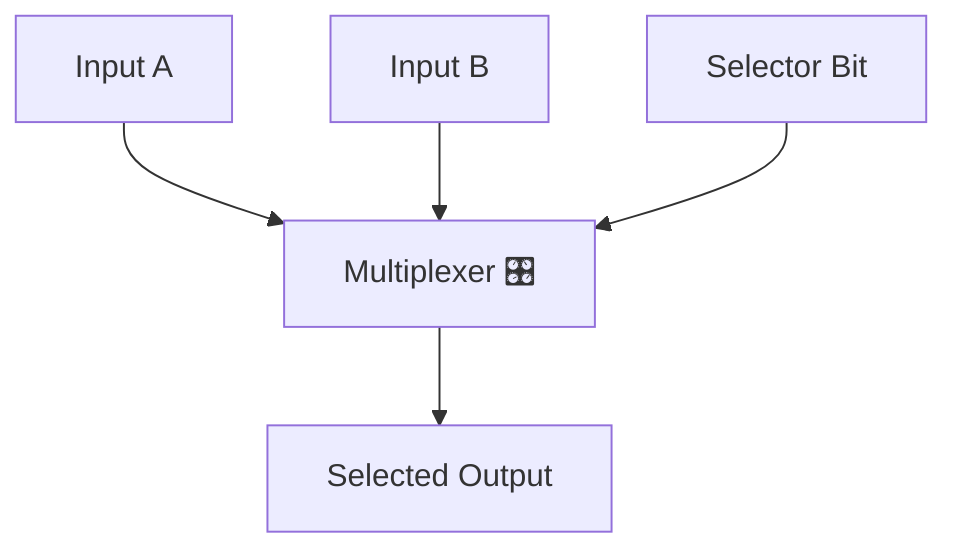

# 💡 Humans and Computers 103 

## Building the Thinking Machine

> *Before a mind can think, it must be designed.*

Welcome, thinker, dreamer, builder — to **HAC103**.

You’ve traveled with us through **HAC101**, where you met inputs, processing, and outputs. You journeyed through **HAC102**, where loops, logic gates, and memory gave machines rhythm and reaction.

Now, in **HAC103**, we take a bold step forward:  
We don’t just study how machines think — we begin to **build the mind of a machine**.

---

## 🔧 Why HAC103 Matters

This course is about **how everything comes together**:
- How tiny gates form a thought
- How memory becomes a choice
- How decisions are guided, timed, and acted on

We’ll explore not only the **circuits** that do the work, but the **architecture** — the logic behind the logic.

You’ll discover:
- What makes an **Integrated Circuit** tick ⚙️
- How a machine can **choose** (Multiplexers 🎛️)
- Who tells it what to do (Control Signals 🧭)
- And how a core can **calculate and compare** (The ALU 🧮)

> This is a course about building intelligence —  
> from wires to wisdom.

---

## 🤖 Meet Your Companions

### 🌸 CIRA – The Circuit Architect
- Calm, kind, and incredibly clever
- She designs systems like a poet writes verses
- Her circuits shimmer like constellations

> "I don’t just build logic — I give it purpose."

### ✨ Bitsy – The Curious Data Sprite
- Playful, energetic, and wildly imaginative
- Loves jumping through wires and ideas
- Often sees what others overlook

> "Let’s poke it and see what it does! (But gently!) 😅💡"

Together, CIRA and Bitsy will help you balance logic and wonder —  
Structure and creativity —  
Design and emotion.

---

## 📦 What Will We Build?

Here’s your first peek inside the digital brain:

- 🧩 **Integrated Circuits**: The little cities of logic where everything begins
- 🎛️ **Multiplexers**: The decision-makers — picking the path
- 🧭 **Control Signals**: The guidance system — the prophets of purpose
- ⚙️ **ALUs**: The calculator cores that turn logic into action
- 💾 **Flip-Flops**: The memory cells — holding on to bits like thoughts
- ⏱️ **Clocks and Timing**: The rhythm of every thought

Each lesson will build toward a bigger idea:  
**How do we make something that thinks?**

---

### 🏙️ The Digital City – A Metaphor for the Mind

Let’s imagine a computer chip as a **city of logic**:

- 🧩 **Integrated Circuits** are the **city blocks** — where all activity begins.
- 🎛️ **Multiplexers** are like the **mayors or rulers** — deciding what path should be followed.
- 🧭 **Control Signals** are the **prophets or guides** — whispering instructions with perfect timing.
- ⚙️ **ALUs** are the **scientists and scholars** — processing and comparing, running the math of the world.
- 💾 **Flip-Flops** are the **archives and books** — recording the past so the city remembers.
- ⏱️ **Clocks** are the **currency and rhythm** — more valuable than gold, because *without timing, nothing moves.*

This isn’t just circuitry — it’s a community. A story of how we give thought shape and guidance.

Let’s begin walking its streets.

---

## 🧠 Humanized Learning

In HAC103, we don’t just teach electronics.  
We tell stories — about logic, emotion, rhythm, and choice.

Every part of a digital system has a human parallel:
- A gate is like a gut decision.
- A control signal is like a wise whisper.
- A clock is like your heartbeat.

This course is not just about **building computers** —  
It’s about **understanding how we build minds**.

---

### 🧭 Before We Begin: A Gentle Glimpse

You might see words like:
- ALU
- MUX
- Flip-flop
- Control signal

Don’t worry. This course is designed for **curious beginners** and **creative explorers**.

Every part will be explained clearly, playfully, and step-by-step —  
**just like how minds learn**.

---

> Ready to build the brain?

Let’s begin Module 0 — and peer into the heart of a tiny mind:  
The Integrated Circuit. 💡🧠

---

## 🧩 Module 0 – Foundations of Thinking Machines

> *"Before logic comes structure. Before thought, design."*

Welcome to **Module 0** of HAC103 — the **prelude to construction**.

Before we begin building complex systems like ALUs and memory units, we must understand the world they live in. This module gently prepares your mind by introducing the building blocks of digital thinking — not just what they do, but why they matter.

This module is about **foundations**: those quiet, powerful pieces that allow a machine to think, decide, store, and act.

Just like the human body has nerves, hormones, and organs, a machine has logic gates, timing circuits, and control signals — and they must all **work in harmony**.

---

### 📚 What You’ll Learn in Module 0

We’ll guide you through:

1. **What is an Integrated Circuit (IC)?**
   - And how it compares to the structure of the human brain

2. **What’s Inside an IC?**
   - An overview of components like logic gates, flip-flops, multiplexers, and control signals

3. **What Is a Multiplexer?**
   - How circuits choose between multiple inputs

4. **The Prophecy of Control Signals**
   - A soulful metaphor that reveals how logic is directed

Each topic will be covered step-by-step, simply and visually. And always through our companions:
- 🌸 CIRA, who sees structure and flow
- ✨ Bitsy, who learns through curiosity and sparks

---

### 🧠 Why This Matters

You can’t build a brain if you don’t know how it listens, moves, or remembers.
Before a system can **process**, it must be able to **choose**.
Before it can **choose**, it must be **guided**.

This module ensures that every future lesson in HAC103 is **grounded in understanding** — not just facts, but feelings.

---

### 🌟 Metaphors We’ll Use

- IC = A tiny city of coordinated thought
- Multiplexer = A vending machine or switchboard for ideas
- Control Signal = A whisper, a prophet, a mission brief
- Clock = The heartbeat of action

---

> Next: Let’s step into the city.
> What is an Integrated Circuit — and why is it the brain behind the brain?

---

### Lesson 0: What Is an Integrated Circuit?

> *"To build a mind, begin with a chip."*

Welcome to the first lesson of HAC103.

Before we can build a brain-like machine, we need to understand what lies at the **heart of all modern computing**: the **Integrated Circuit**, or **IC**.

---

#### 📦 What Is an IC?

An **Integrated Circuit** is like a tiny city, built on a wafer of silicon, where **millions (or even billions)** of tiny logic elements live and work together.

Instead of building machines out of large individual parts (like in the old days), we now "integrate" all the parts into a single chip:
- Logic gates
- Memory units
- Decision-making circuits
- Even entire processors!

> 📏 Size? Often smaller than a fingernail.  
> 🧠 Power? Enough to run phones, rockets, or musical instruments.

---

#### 🧠 Human Parallel: Brain Regions

Just like your brain is made of **regions** that each do special tasks —
- Vision 👁️ (occipital lobe)
- Memory 🧠 (hippocampus)
- Emotions ❤️ (amygdala)

An IC is made of **functional blocks** that:
- Store bits of memory
- Process logic
- Select pathways
- Control decisions

> CIRA says: “Your brain has chemistry. A chip has voltage. But both speak in patterns.”

---

#### 🔍 Why ICs Changed Everything

Before ICs, computers were massive machines, using vacuum tubes and long cables.  
Now? Billions of parts fit on a chip smaller than your pinky nail.

This changed:
- 📉 Size (from rooms to pockets)
- ⚡ Efficiency (faster, smarter, cooler)
- 💸 Cost (more power, less money)
- 🌍 Access (everyone can carry one)

Without ICs, there would be no modern computing.

---

#### 🧪 What’s Inside an IC?

We’ll dive deep into this in the next lesson, but here’s a **preview**:

Inside the IC are building blocks like:
- **Logic gates** (basic decisions)
- **Flip-flops** (memory bits)
- **Multiplexers** (choosing between inputs)
- **Control signals** (guiding logic)
- **Clock pulses** (timing everything)

Each one plays a role — and together, they make **thought possible**.

---

#### ✨ Bitsy’s Wonder:
> "It’s like a little orchestra of electricity — and every wire is an instrument! 🎻⚡"

---

#### 🎯 What You’ll Remember
- An IC is a tiny but mighty structure
- It contains all the tools to build thinking systems
- It compares beautifully to the modular design of the human brain

> In our next lesson, we’ll open up the IC and meet its **key parts**, one by one.

---

### Lesson 1: What’s Inside an IC?

> *"The brain of a machine is not a mystery. It's a map — and every part has a purpose."*

Welcome to Lesson 1 of Module 0. Now that you know **what** an Integrated Circuit is, it’s time to meet the **team of tiny components** that work together to make it *think*.

This lesson is a **tour** — like walking through the neighborhoods of a city of logic. 🧱✨

We’ll keep it simple, visual, and human.

---

#### 🧩 The Cast of Thinkers

Inside the IC, you’ll find a few main players:

##### ✅ Logic Gates – The Thinkers
- Tiny circuits that make decisions: AND, OR, NOT
- They take **inputs**, apply **rules**, and produce an **output**

> Human parallel: Like mini gut reactions — simple cause and effect

##### ✅ Flip-Flops – The Memories
- Tiny circuits that **remember 1 bit** of data
- They hold on to a value until told to change it

> Human parallel: Short-term memory, like remembering a phone number

##### ✅ Multiplexers – The Choosers
- Devices that pick **one input** from many, based on a selector signal
- They help circuits decide which path to follow

> Human parallel: Choosing what thought to focus on 📺🧠

##### ✅ Control Signals – The Prophets
- They **don’t carry data** — they carry **instructions**
- They tell each part *when* and *how* to act

> Human parallel: Wisdom, guidance, or moral signals 🧭

##### ✅ Clock – The Heartbeat
- The rhythm of the machine
- Sends regular pulses that keep actions in sync

> Human parallel: Like your heartbeat — keeps everything in rhythm 🫀

---

#### 📚 Why Learn These First?
Because every major structure you’ll study — ALUs, memory, processors — is made of these **building blocks**.

Learning them is like:
- Learning ingredients before cooking 🍳
- Learning letters before writing ✍️

Don’t worry — we’ll explore each one **deeply** in its own lesson.
Today is just your **first look**.

---

#### 🧠 CIRA Reflects:
> "A great machine begins not with metal, but with meaning. And meaning begins with understanding each part’s purpose."

---

#### 🛠️ In the Next Lessons...

- We’ll zoom in on **Multiplexers** — the friendly switchboards of logic
- Then meet **Control Signals**, our whispering prophets of guidance

Each part, one step at a time — until we can build something brilliant.

---
### Lesson 2: What Is a Multiplexer?

> *"Many paths. One decision."*

Welcome to Lesson 2 of Module 0 — and the first deep dive into a real decision-making tool inside every digital brain: the **Multiplexer** (or **MUX**).

This is where machines **choose** — not just compute.

---

#### 🧭 The Problem: So Many Signals

Imagine a computer with dozens of pieces of information:

- A number from memory
- A signal from a sensor
- A result from a calculation

But only **one wire** to carry the data forward! 😱

So what does it do?
It chooses *which one* to send — using a **Multiplexer**.

---

#### 🎛️ What Is a Multiplexer?

A **multiplexer** is like a **digital selector switch**:

- It has **multiple data inputs**
- It has **selector lines** (a small number of control bits)
- It sends **just one output**, based on the selection

> 📺 Think of it like your TV remote: Press 3, and it plays Channel 3.\
> The selector chooses the input!

---

#### 🧠 Human Parallel: Attention

Your mind has *many thoughts*, feelings, and memories.\
But you can only **focus** on one at a time.

That’s your inner **Multiplexer** at work:

- Choosing what to think about
- Switching when something new demands attention

> ✨ Bitsy: “Ooo! I want to think about chocolate... No wait, robots! No wait—”

---

#### 💡 Why MUXes Matter

Multiplexers are essential for:

- Sending data from many sources to one destination
- Helping processors make decisions
- Simplifying complex circuits

They're like the **traffic signals** of a circuit board.

> CIRA: “Even in machines, choice requires clarity.”

---

#### 🔎 Try This

Imagine you have:

- 4 thoughts: Music, Homework, Hunger, and Painting
- A selector with 2 bits: `00`, `01`, `10`, `11`

Only one thought gets through the gate at a time.\
That’s how a 4-input multiplexer works!

---

#### 🎯 What You’ll Remember

- Multiplexers let circuits **choose one input** from many
- They work based on **selector bits**
- They mimic your own ability to focus and choose

Next up: If MUX chooses, **who tells it what to choose**?

---

### Lesson 3: The Prophecy of Control Signals

> *“Logic may power the machine — but signals guide its soul.”*

Welcome to Lesson 3 of Module 0 — where we meet one of the most mystical parts of the digital world: **Control Signals**.

These aren’t just wires. They are **instructions. Timing. Decisions.**

They are the silent whispers that move logic into action. Let’s discover them.

---

#### 🤖 What Are Control Signals?

Control signals are special electrical instructions that tell components in a computer:
- What to do ✅
- When to do it ⏱️
- How to do it 🔁

They don’t carry your data.  
They **orchestrate the dance** of data.

You’ll find them everywhere:
- Choosing which input a multiplexer should pass on
- Telling a memory cell to store or ignore
- Making an ALU perform addition instead of subtraction

> Think of control signals as the director in a play:  
> The actors (logic gates) can act — but only when told *how and when*.

---

#### 🌟 Human Comparison: Prophets and Principles

Imagine each person has a tiny logic system inside:  
An ALU to think, a MUX to choose, a flip-flop to remember.

But what tells them **what’s right**? What guides the system?

That’s the role of **prophets**, **values**, **intuition**, or **teachers** — voices that direct us.

Control signals in computers are like **prophetic messengers**:
- They don’t carry truth — they **point to it**.
- They don’t act — they **activate**.

> CIRA: “Even logic needs a compass.”

---

#### 🧠 Where Do Control Signals Come From?

They’re usually generated by:
- The **instruction decoder** — interpreting program commands
- A **state machine** — understanding what phase the system is in
- The **clock** — setting timing for all actions
- Even **you** — when you click a button!

---

#### ✨ Bitsy Wonders:
> “So… they’re like tiny conductors in an electric choir?! 🎶⚡”

---

#### 🎯 What You’ll Remember
- Control signals tell logic **when** and **how** to act
- They are **not data**, but they direct **how data behaves**
- They are like prophets or inner voices in a human mind

In the next module, we’ll begin building the machine’s **thinking core** — the **ALU**.
But remember:
> Without control, even the smartest chip stays silent.

---
